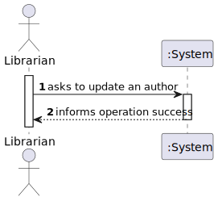
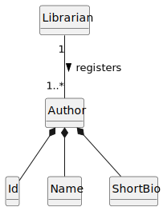
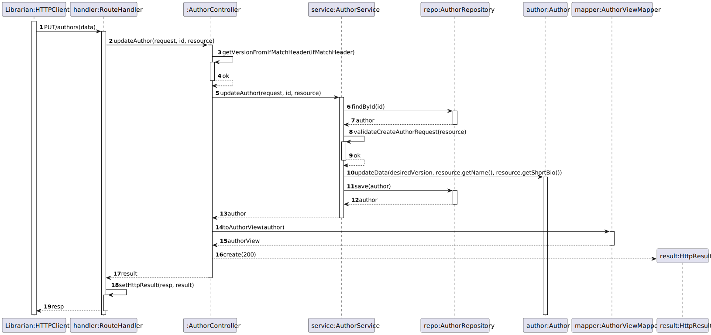
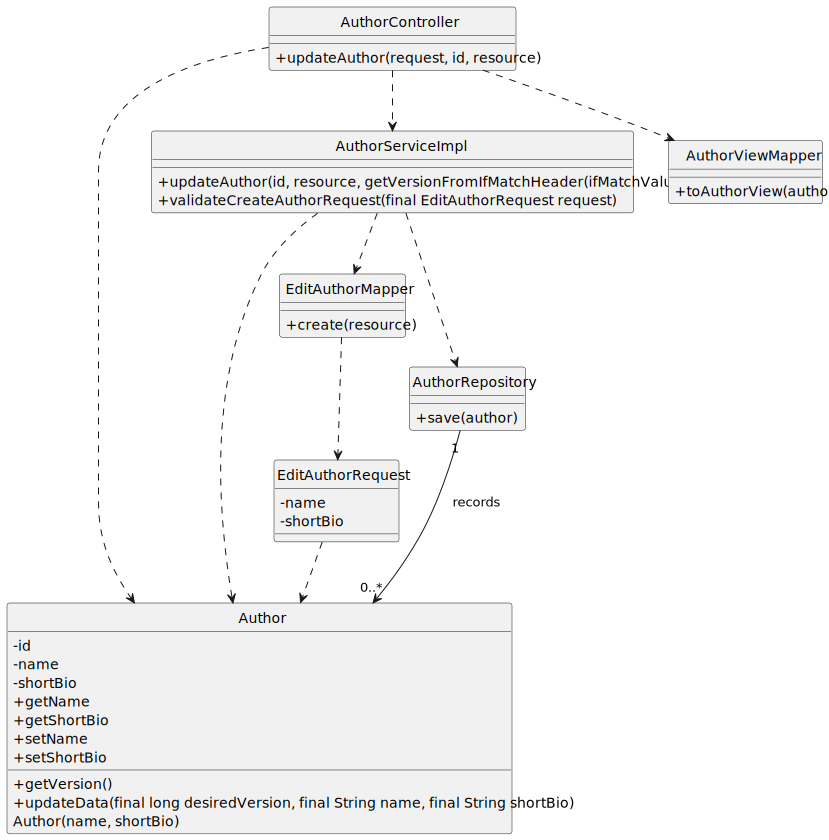

# US 04 - Update an author

## 1. Requirements Engineering

### 1.1. User Story Description

As Librarian, I want to update an author’s data.

### 1.2. Customer Specifications and Clarifications

**From the specifications document:**

> Must be able to update an author data.

**From the client clarifications:**

> **Question:**
> Que informações do autor é que o bibliotecário pode alterar? \
> **Answer:**
> À exceção do "author number" pode alterar qualquer informação.

> **Question:**
> Quais são os critério de aceitação (acceptance criteria) da us04? \
> **Answer:**
> Podem alterar qualquer dado do autor excepto o número de autor.
> Os dados introduzidos devem respeitar o formato correto.
> Deve ser possível “limpar” os dados opcionais.

> **Question:**
> Não existem dados opcionais de um Author segundo o seguinte tópico, certo? \
> **Answer:**
> A foto do autor é opcional.

### 1.3. Acceptance Criteria

- AC04-01: Any data from the author can be edited except the author number.
- AC04-02: The data inserted as to respect the correct format.
- AC04-03: It must be possible to "clean" the optional data.

### 1.4. Found out Dependencies

* The author must be registered.

### 1.5 Input and Output Data

**Input Data:**

- Typed Data:

    - Name;
    - Short bio.

**Output Data:**

- Success of the operation.

### 1.6. System Sequence Diagram (SSD)

### 1.7 Functionality

n/a

### 1.8 Other Relevant Remarks

n/a

## 2. OO Analysis

### 2.1. Relevant Domain Model Excerpt

### 2.2. Other Remarks

- n/a

## 3. Design - User Story Realization

### 3.1. Sequence Diagram (SD)

### 3.2. Class Diagram (CD)

## 4. Tests

- The Tests are in the folder tests.

## 5. Observations

- There is two different implementations for this US that have been coded, 
one using the PATCH request and another using the PUT. The first one lets the 
user edit just one or more attributes of the author. Meanwhile, the other 
requires that all the attributes of the author are changed. This documentation
covers the PUT request.