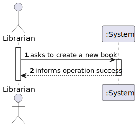
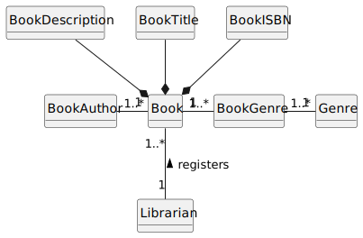
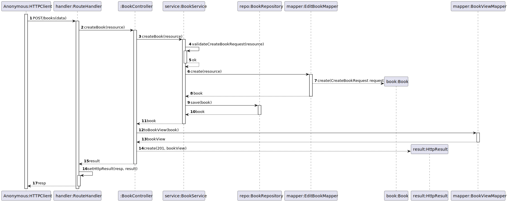
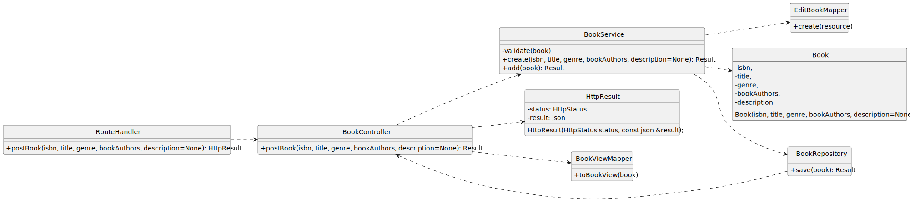

# US 07 - Register a book

## 1. Requirements Engineering

### 1.1. User Story Description

As Librarian, I want to register a book (isbn, title, genre, description, author(s)).

### 1.2. Customer Specifications and Clarifications 

**From the client clarifications:**

> **Question:** Podemos criar um livro com autores que ainda não foram criados? E estes autores deverão ser posteriormente guardados no sistema?

> > **Answer:** Os autores devem ser criados previamente e depois selecionados aquando da criação do livro.
Notem que para os grupos que não estão a desenvolver o work package “author” esta resposta não se aplica

> **Question:** Boa tarde, quais são os critérios de aceitação da US08?

> > **Answer:** Podem alterar todos os dados do livro a exceção do isbn.
Deve ser possível “limpar” os dados não obrigatórios

> **Question:** Quais são os critérios de aceitação da descrição ? Existe um número mínimo e/ou máximo de caractéres ? Em relação ao titulo do livro , apenas devem ser permitidas letras? Existem palavras proibidas ?

> > **Answer:** maximo 4096 caracteres,pode conter qualquer caracter alfanumérico. não existem palavras proibidas.

> **Question:** boa tarde, como verificamos que um livro está disponível para ser requisitado?

> > **Answer:** o sistema que estão a desenvolver vai ser utilizado pelo bibliotecário que vai entregar fisicamente o livro ao leitor. o sistema nao necessita controlar o numero de exemplares de cada livro nem a sua disponibilidade

> **Question:** Boa noite, quais são os critério de aceitação (acceptance criteria) da us07?

> > **Answer:** se tentar registar um livro com um ISBN já existente deve ser indicado um erro
ISBN usamos o formato ISBN-10 ou ISBN-13
titulo do livro é obrigatório e não pode comecar ou terminar em espaços
descrição é opcional e deve suportar conteudo HTML
género e autor são obrigatórios

> **Question:** Boa tarde, gostaria de saber como o Bibliotecário(Librarian) obtém a informação do livro que gostaria de registar (isbn, title, genre, description, author(s)).

> > **Answer:** Penso que essa pergunta nao e relevante pois a resposta nao deveria ter impacto algum na vossa implementacao.
Voces nao vao integrar o metodo do bibliotecario encontrar essa informacao no vosso produto, neste ponto em particular so precisam de saber quais (e de que tipo sao) os dados que ele quer introduzir.
Para efeitos de teste podem ou inventar ou ir procurar online essa informacao.

> > **Answer:** boa tarde,o Bibliotecário já possui essa informação. serão dados de input para este caso de uso

### 1.3. Acceptance Criteria

- AC07-1: ISBN must not be empty or fewer than ten characters for ISBN-10 or thirteen characters for ISBN-13.
- AC07-2: Book title is mandatory and cannot start or end with spaces.
- AC07-3: Description, if provided, must support HTML content.
- AC07-4: Isbn, title, genre and author fields are mandatory.

### 1.4. Found out Dependencies

- No dependencies were found.

### 1.5 Input and Output Data

**Input Data:**

- Typed data:
    - ISBN 
    - Title
    - Genre(s)
    - Description (optional)
    - Author(s)

- Selected data:
    - n/a

**Output Data:**

- (In)success of the operation

### 1.6. System Sequence Diagram (SSD)

### 1.7 Functionality

- n/a

### 1.8 Other Relevant Remarks

- The created book is ready to be used in the library.

## 2. OO Analysis

### 2.1. Relevant Domain Model Excerpt 

### 2.2. Other Remarks

- n/a

## 3. Design - User Story Realization

### 3.1. Sequence Diagram (SD)

### 3.2. Class Diagram (CD)

## 4. Tests

- The Tests are in the folder tests.

## 5. Observations

n/a
