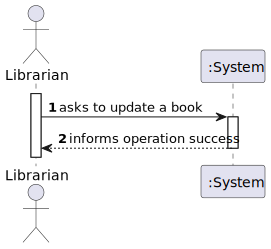
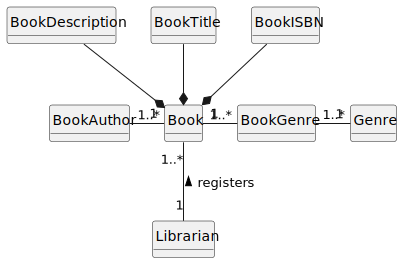
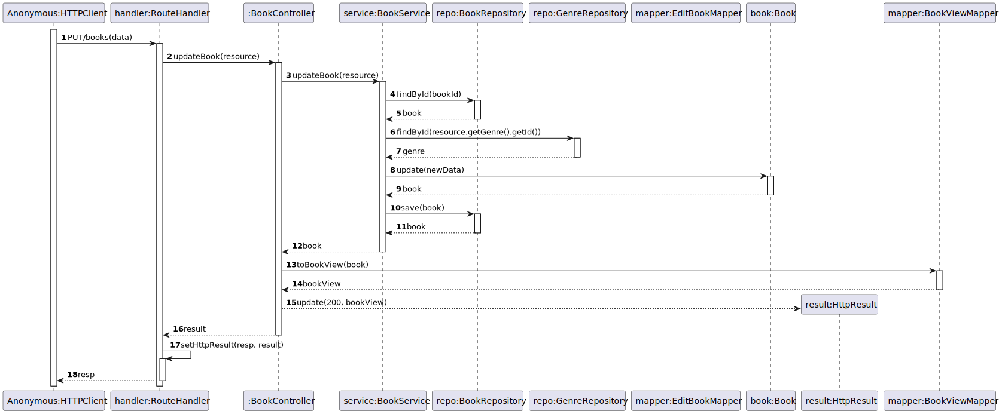
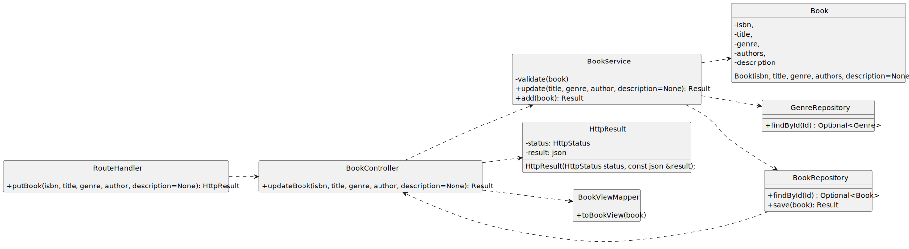

# US 08 - Update a book

## 1. Requirements Engineering

### 1.1. User Story Description

As Librarian, I want to update a book’s data.

### 1.2. Customer Specifications and Clarifications

**From the client clarifications:**

> **Question:** Boa noite, qual o dado que precisamos de introduzir para proceder à atualização dos dados de um livro?

> > **Answer:** bom dia, à execção do ISBN todos os dados sao alteraveis

> **Question:** Boa tarde, quais são os critérios de aceitação da US08?

> > **Answer:** Bom dia
Podem alterar todos os dados do livro a exceção do isbn.
Deve ser possível “limpar” os dados não obrigatórios

### 1.3. Acceptance Criteria

- AC08-1: All book data can be altered except for the ISBN.
- AC08-2: It should be possible to 'clear' non-mandatory data.

### 1.4. Found out Dependencies

- No dependencies were found.

### 1.5 Input and Output Data

**Input Data:**

- Typed data:
    - ISBN 
    - Title 
    - Genre
    - Description (optional)
    - Author(s)

- Selected data:
    - n/a

**Output Data:**

- (In)success of the operation

### 1.6. System Sequence Diagram (SSD)

### 1.7 Functionality

- n/a

### 1.8 Other Relevant Remarks

- The created book is ready to be used in the library.

## 2. OO Analysis

### 2.1. Relevant Domain Model Excerpt 

### 2.2. Other Remarks

- n/a

## 3. Design - User Story Realization

### 3.1. Sequence Diagram (SD)

### 3.2. Class Diagram (CD)

Class diagram as resulting from the above sequence diagram and rationale:

## 4. Tests

- The Tests are in the folder tests.

## 5. Observations

n/a
