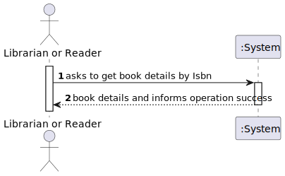
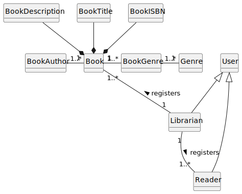
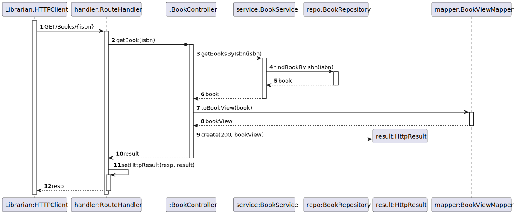
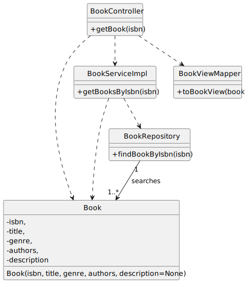

# US 09 - Get book details by ISBN

## 1. Requirements Engineering

### 1.1. User Story Description

As Librarian or Reader I want to know the details of a book given its ISBN

### 1.2. Customer Specifications and Clarifications 

**From the client clarifications:**

> **Question:** Boa tarde, quais são os critérios de aceitação das us09(As Librarian or Reader I want to know the details of a book given its ISBN) e us10(. As Librarian or Reader I want to search books by genre)?

> > **Answer:** devem ser mostrados todos os dados do livro (isbn, title, genre, description, author(s))

### 1.3. Acceptance Criteria

- AC09-1: All the book data must be shown (ISBN, title, genre, description, author(s)).

### 1.4. Found out Dependencies

- No dependencies were found.

### 1.5 Input and Output Data

**Input Data:**

- Typed data:
    - ISBN

- Selected data:
    - n/a

**Output Data:**

- (In)success of the operation
- Book details

### 1.6. System Sequence Diagram (SSD)

### 1.7 Functionality

- n/a

### 1.8 Other Relevant Remarks

- The created book is ready to be used in the library.

## 2. OO Analysis

### 2.1. Relevant Domain Model Excerpt 

### 2.2. Other Relevant Remarks

- n/a

## 3. Design

### 3.1. Sequence Diagram (SD)

### 3.2. Class Diagram (CD)

Class diagram as resulting from the above sequence diagram and rationale:

## 4. Tests

- The Tests are in the folder tests. 

## 5. Observations

n/a
