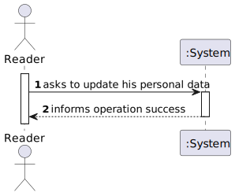
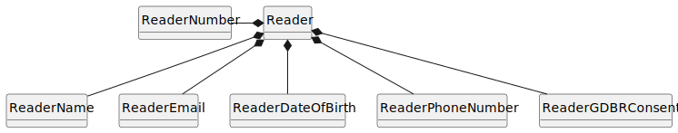
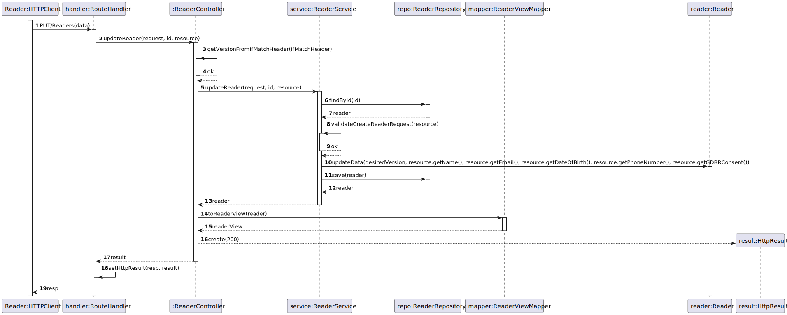
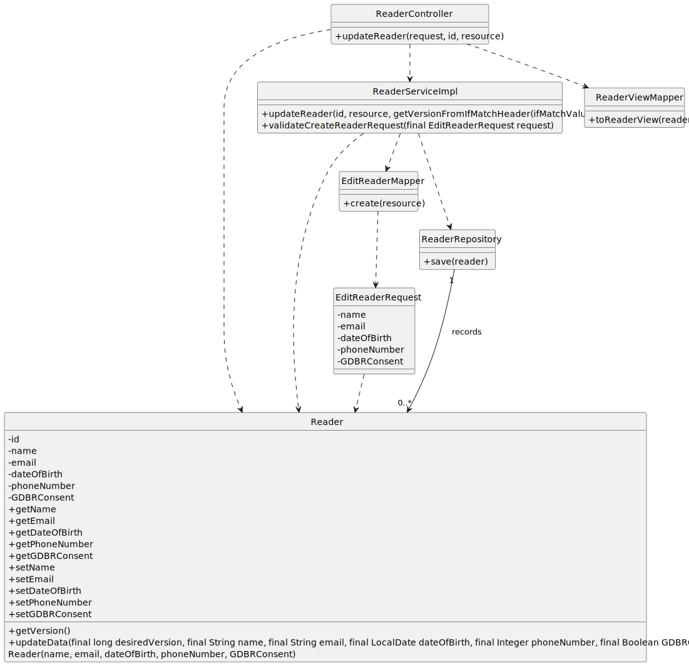

# US 12 - I want to update my personal data.

## 1. Requirements Engineering

### 1.1. User Story Description

As Reader I want to update my personal data, e.g., phone number

### 1.2. Customer Specifications and Clarifications

**From the specifications document:**

- n/a

**From the client clarifications:**

> **Question:** Como leitor posso alterar todos os meus dados? Se não, quais? - sim, à exceção do número de leitor

> > **Answer:** sim, à exceção do número de leitor

> **Question:** Relativamente ao US 12 - "As Reader I want to update my personal data, e.g., phone number"
Atributos do Reader --> Reader Number, name, email, dateOfBirth, phone number, GDPR consent
Qual será o(s) atributo(s) que o reader não poderá atualizar?

> > **Answer:** Bom dia
Não pode alterar o reader number apenas

### 1.3. Acceptance Criteria

- AC12-01: The reader´s number cannot be changed by the reader.

### 1.4. Found out Dependencies

* No dependencies were found.

### 1.5 Input and Output Data

**Input Data:**

- Typed Data:

  - Name
  - E-mail
  - Date Of Birth
  - Phone Number
  - GDPR consent

**Output Data:**

  - (In)Success of the operation.

### 1.6. System Sequence Diagram (SSD)

### 1.7 Functionality

- n/a

### 1.8 Other Relevant Remarks

- n/a

## 2. OO Analysis

### 2.1. Relevant Domain Model Excerpt

### 2.2. Other Remarks

- n/a

## 3. Design - User Story Realization

### 3.1. Sequence Diagram (SD)

### 3.2. Class Diagram (CD)

## 4. Tests

- The Tests are in the folder tests.

## 5. Observations

- There is two different implementations for this US that have been coded,
  one using the PATCH request and another using the PUT. The first one lets the
  user edit just one or more attributes of the reader. Meanwhile, the other
  requires that all the attributes of the reader are changed. This documentation
  covers the PUT request.
