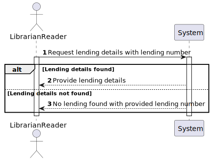
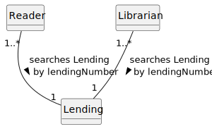
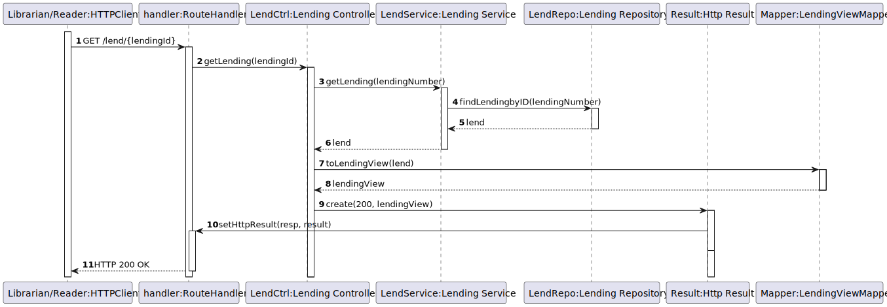

# US 17 - As Reader or Librarian I want to know the details of a lending.

## 1. Requirements Engineering

### 1.1. User Story Description

As Reader or Librarian I want to know the details of a lending given its lending number.

### 1.2. Customer Specifications and Clarifications 

**From the client clarifications:**

> **Question:** Deve ser possível que o leitor e o bibliotecário tenham acesso aos detalhes de um empréstimo através do seu número.
Pode especificar quais são os detalhes que devem ser facultados? Existe alguma diferença nos detalhes a serem facultados, caso seja um leitor ou um bibliotecário a solicitar?

> > **Answer:** a ambos deve ser facultado:
lending number,
book title,
lending date,
return date,,
number of days till return date (if applicable),
number of days in overdue (if applicable),
fine amount (if applicable).

> **Question:** O lending number é um id auto-gerado e auto-incrementado?

> > **Answer:** o lending number é um número criado pelo sistema e composto pelo ano de registo e um número sequencial, ex., 2023/1, 2024/19876

### 1.3. Acceptance Criteria

- n/a

### 1.4. Found out Dependencies

- No dependencies were found.
  
### 1.5 Input and Output Data

**Input Data:**

- Typed data:
    - Lending Code
  
- Selected data:
    - n/a

**Output Data:**

- (In)success of the operation
- Lending details

### 1.6. System Sequence Diagram (SSD)

### 1.7 Functionality

- n/a

### 1.8 Other Relevant Remarks

- n/a

## 2. OO Analysis

### 2.1. Relevant Domain Model Excerpt 

### 2.2. Other Relevant Remarks

- n/a

## 3. Design

### 3.1. Sequence Diagram (SD)

### 3.2. Class Diagram (CD)

Class diagram as resulting from the above sequence diagram and rationale:

## 4. Tests

- The Tests are in the folder tests.

## 5. Observations

n/a
