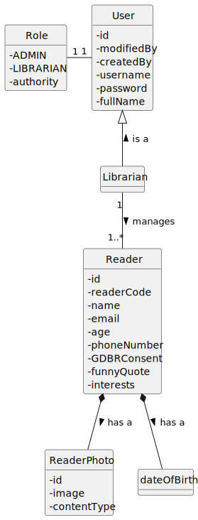
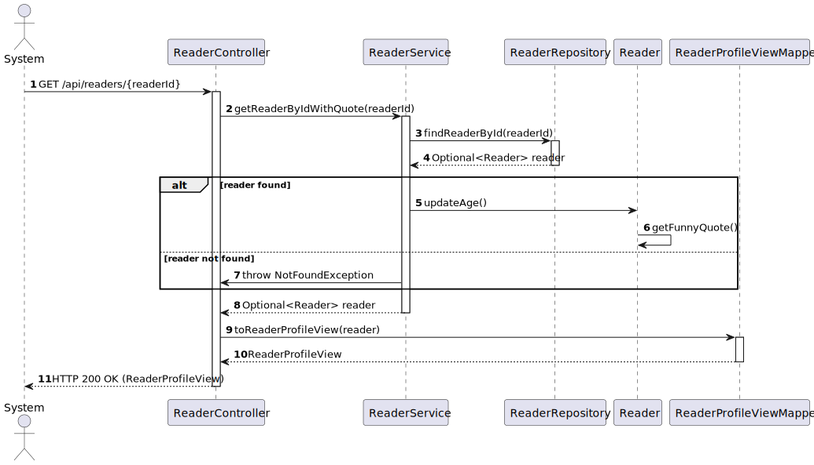
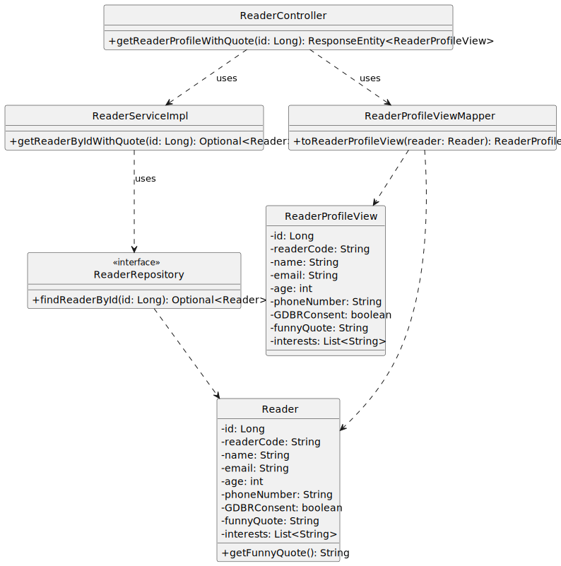

# US 26 - Augment the reader profile with a funny quote

## 1. Requirements Engineering

### 1.1. User Story Description

Augment the reader profile with a funny quote based on the date of birth of the reader. 

### 1.2. Customer Specifications and Clarifications

**From the specifications document:**

>n/a

**From the client clarifications:**

> **Question:**
>Boa tarde.
Relativamente à funcionalidade das funny quotes de acordo com o mes ou ano de nascimento do reader, é necessario ser ilustrada as informação de todos os readers e adicionalmente a funnyquote de cada reader ou so quer esta funcionalidade relativamente a um specific reader à parte?

> **Answer:**
>Apenas de um dado reader quando se obter o perfil do mesmo

### 1.3. Acceptance Criteria

- AC26-01: While returning the reader´s data it should include a new attribute which contains a citation/fact which happend on the reader´s birthday date(year/month).

### 1.4. Found out Dependencies

* No dependencies were found.

### 1.5 Input and Output Data

**Input Data:**

- Typed Data:
  - id

**Output Data:**

  - (In)Success of the operation.
    - id
    - readerCode
    - name
    - email
    - age
    - phoneNumber
    - GDBRConsent
    - interests
    - funnyQuote

### 1.6 Functionality

- n/a

### 1.7 Other Relevant Remarks

- n/a

## 2. OO Analysis

### 2.1. Relevant Domain Model Excerpt

### 2.2. Other Remarks

- n/a

## 3. Design - User Story Realization

### 3.1. Sequence Diagram (SD)

### 3.2. Class Diagram (CD)

## 4. Tests

- n/a

## 5. Observations

- n/a
