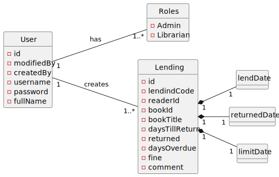
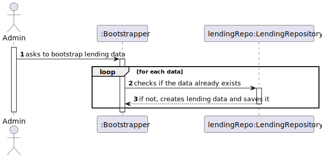
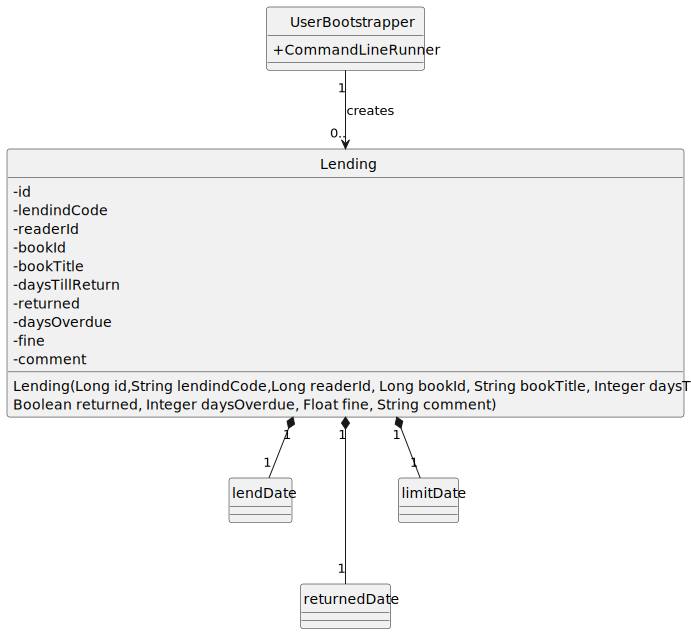

# US 02 - “bootstrap” lending data

## 1. Requirements Engineering

### 1.1. User Story Description

As Admin, I want to “bootstrap” lending data with meaningful data and volume for the data exploration use cases
(e.g., Top 5 books)

### 1.2. Customer Specifications and Clarifications

**From the specifications document:**

>

**From the client clarifications:**

> **Question:**
>

> **Answer:**
>

### 1.3. Acceptance Criteria

-n/a

### 1.4. Found out Dependencies

* No dependencies were found.

### 1.5 Input and Output Data

**Input Data:**

- Typed Data:
  - n/a

**Output Data:**

- (In)Success of the operation.

### 1.6 Functionality

- n/a

### 1.7 Other Relevant Remarks

- n/a

## 2. OO Analysis

### 2.1. Relevant Domain Model Excerpt

### 2.2. Other Remarks

- n/a

## 3. Design - User Story Realization

### 3.1. Sequence Diagram (SD)

### 3.2. Class Diagram (CD)

## 4. Tests

- n/a

## 5. Observations

- n/a
