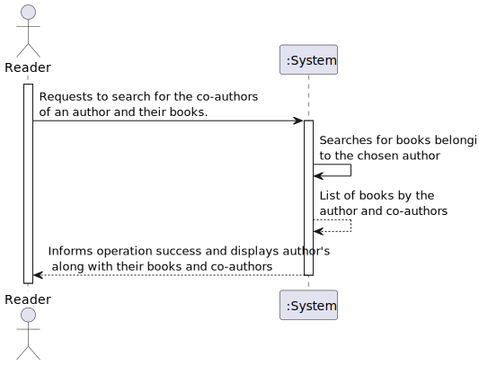
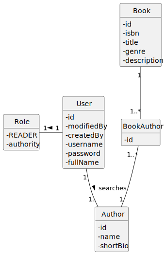
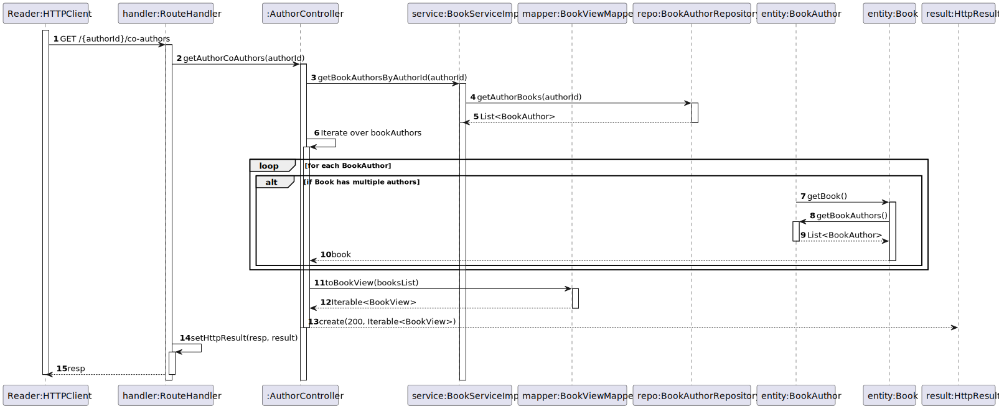
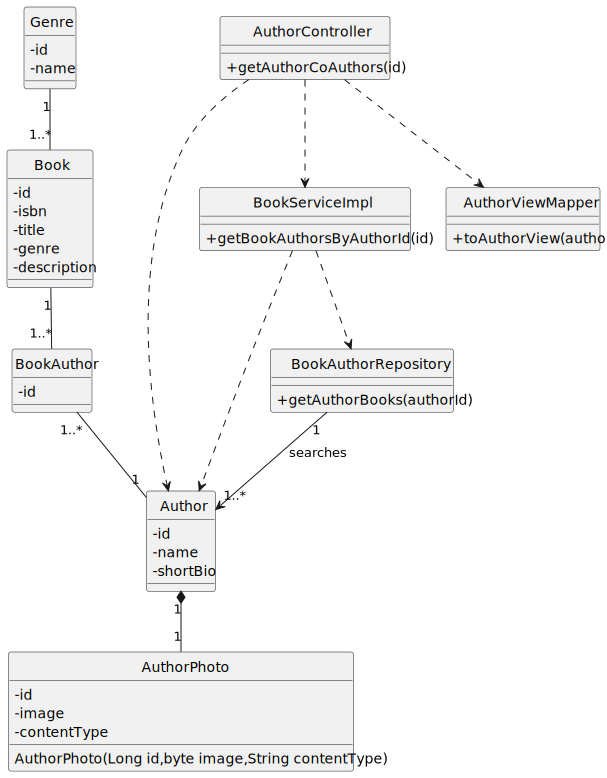

# US 05 - Know the co-authors of an author and their books.

## 1. Requirements Engineering

### 1.1. User Story Description

As Reader I want to know the co-authors of an author and their respective books.

### 1.2. Customer Specifications and Clarifications

**From the specifications document:**

> 

**From the client clarifications:**

> **Question:** Os co-authors devem ser guardados nos livros? Se sim, quando o livro é criado para além dos atributos da WP anterior temos de criar o livro com mais este atributo?

> **Answer:** o requisito "7. As Librarian, I want to register a book (isbn, title, genre, description, author(s))" do WP 1 já devia ter permitido o registo de livros com vários autores. não se trata de um novo atributo "coautor"

### 1.3. Acceptance Criteria

- AC05-01: Should return a list of authors who have written books together with a given author. 
- AC05-02: For each co-author, the function should return a list of books written together.
- AC05-03: The function should consider pagination if the list is too long.

### 1.4. Found out Dependencies

* The author must be registered.

### 1.5 Input and Output Data

**Input Data:**

- Typed Data:

    - 
    - 

**Output Data:**

- (In)Success of the operation.

### 1.6. System Sequence Diagram (SSD)

### 1.7 Functionality

n/a

### 1.8 Other Relevant Remarks

n/a

## 2. OO Analysis

### 2.1. Relevant Domain Model Excerpt

### 2.2. Other Remarks

- n/a

## 3. Design - User Story Realization

### 3.1. Sequence Diagram (SD)

### 3.2. Class Diagram (CD)

## 4. Tests

- The Tests are in the folder tests.

## 5. Observations

- 
