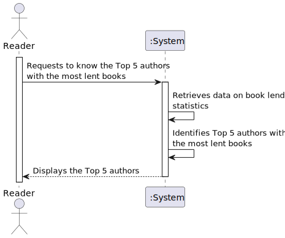

# US 06 - Know the Top 5 authors

## 1. Requirements Engineering

### 1.1. User Story Description

As Reader I want to know the Top 5 authors (which have the most lent books)

### 1.2. Customer Specifications and Clarifications

**From the specifications document:**

> 

**From the client clarifications:**

> **Question:** O que é esperador retornar? Top 5 dos autores por ordem e ao lado o total de lendings de cada um deles?

> **Answer:** sim

### 1.3. Acceptance Criteria

- AC06-01: Should return the top 5 author with the largest number of requested books in the last year.

### 1.4. Found out Dependencies

* 

### 1.5 Input and Output Data

**Input Data:**

- Typed Data:

    - 
    - 

**Output Data:**

- (In)Success of the operation.

### 1.6. System Sequence Diagram (SSD)

### 1.7 Functionality

n/a

### 1.8 Other Relevant Remarks

n/a

## 2. OO Analysis

### 2.1. Relevant Domain Model Excerpt

### 2.2. Other Remarks

- n/a

## 3. Design - User Story Realization

### 3.1. Sequence Diagram (SD)

### 3.2. Class Diagram (CD)

## 4. Tests

- The Tests are in the folder tests.

## 5. Observations

- 
