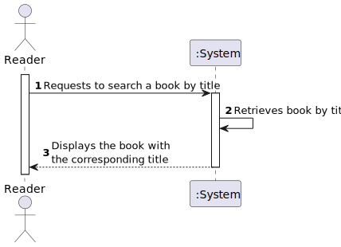
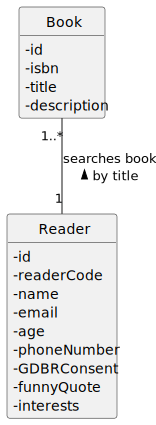
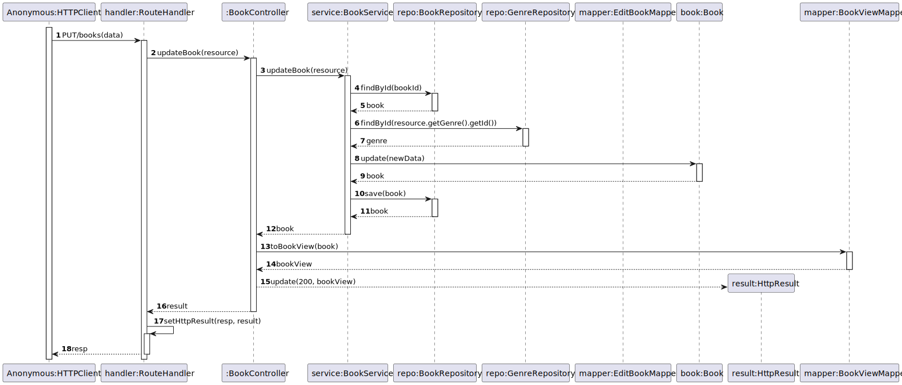
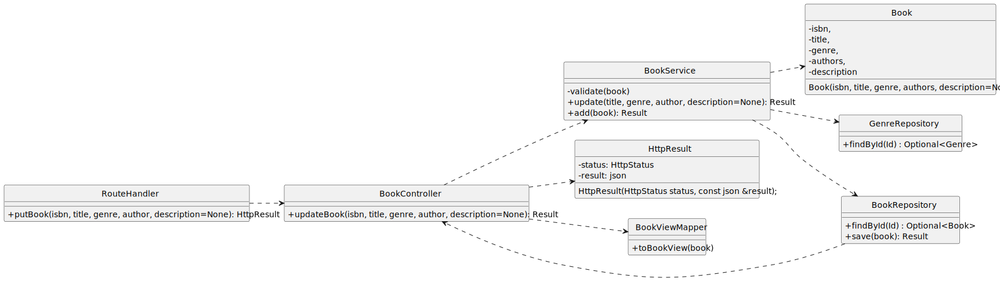

# US 08 - Search books by title

## 1. Requirements Engineering

### 1.1. User Story Description

As Reader I want to search books by title

### 1.2. Customer Specifications and Clarifications

**From the client clarifications:**

> **Question:** 

> > **Answer:** 

### 1.3. Acceptance Criteria

- AC08-1: Ability to search by title entering the first letters of the title

### 1.4. Found out Dependencies

- No dependencies were found.

### 1.5 Input and Output Data

**Input Data:**

- Typed data:
    -

- Selected data:
    - n/a

**Output Data:**

- (In)success of the operation
- Books

### 1.6. System Sequence Diagram (SSD)

### 1.7 Functionality

- n/a

### 1.8 Other Relevant Remarks

- The created book is ready to be used in the library.

## 2. OO Analysis

### 2.1. Relevant Domain Model Excerpt 

### 2.2. Other Remarks

- n/a

## 3. Design - User Story Realization

### 3.1. Sequence Diagram (SD)

### 3.2. Class Diagram (CD)

Class diagram as resulting from the above sequence diagram and rationale:

## 4. Tests

- The Tests are in the folder tests.

## 5. Observations

n/a
