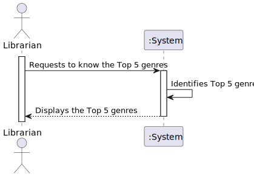
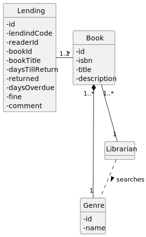
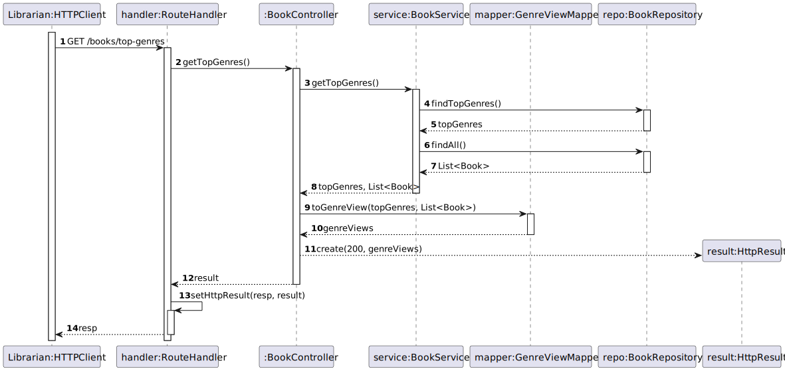
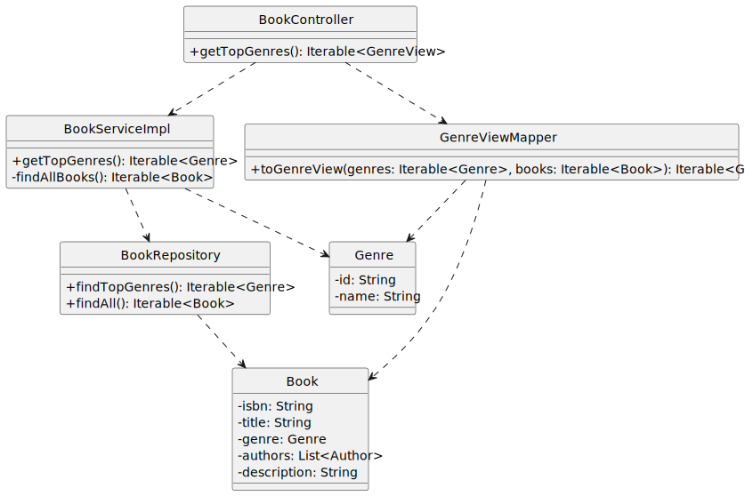

# US 10 - Know the Top 5 genres

## 1. Requirements Engineering

### 1.1. User Story Description

As Librarian I want to know the Top 5 genres

### 1.2. Customer Specifications and Clarifications 

**From the client clarifications:**

> **Question:** Boa tarde,
É pretendido:
top 5 genres dos livros da biblioteca. 
> top 5 genres dos livros dos lendings (ativos ou não).
   Obrigado pela atenção.

> > **Answer:** Top 5 dos géneros com mais livros na biblioteca

### 1.3. Acceptance Criteria

- AC10-1: Returns the 5 genres that the librarian possesses more books of. It must return the number of books per genre.The result must be sorted descending order.

### 1.4. Found out Dependencies

- No dependencies were found.

### 1.5 Input and Output Data

**Input Data:**

- Typed data:
    - 

- Selected data:
    - n/a

**Output Data:**

- (In)success of the operation
- List of books based on the genre that has been given to the API

### 1.6. System Sequence Diagram (SSD)

### 1.7 Other Relevant Remarks

- n/a

### 1.8 Other Relevant Remarks

- n/a

## 2. OO Analysis

### 2.1. Relevant Domain Model Excerpt 

### 2.2. Other Remarks

- n/a

## 3. Design - User Story Realization

### 3.1. Sequence Diagram (SD)

### 3.2. Class Diagram (CD)

## 4. Tests

- The Tests are in the folder tests.

## 5. Observations

n/a
