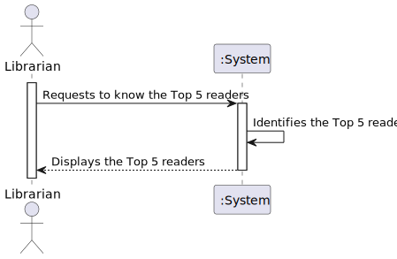
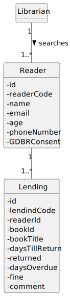
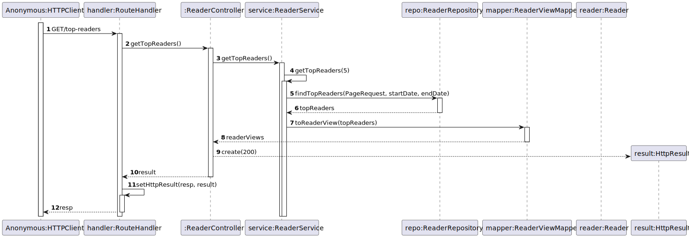
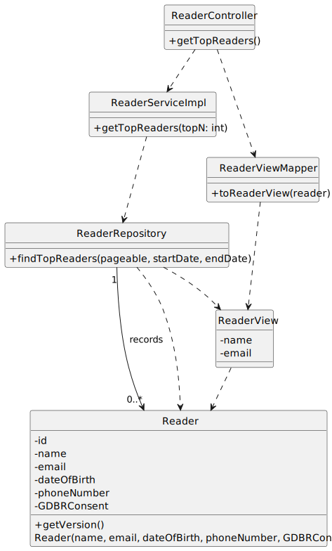

# US 11 - Know the Top 5 readers

## 1. Requirements Engineering

### 1.1. User Story Description

As Librarian, I want to know the Top 5 readers

### 1.2. Customer Specifications and Clarifications

**From the specifications document:**

- A Reader Number is assigned to me by the library.

**From the client clarifications:**

> **Question:** O que é que define o TOP 5 de readers? A quantidade de livros emprestados ao reader?
Devem ser tidos em conta mais métodos de sorting para além do top5 por lendings (critério e/ou quantidade de resultados)? (possivel implementação desses métodos no futuro)

> > **Answer:** sim, os "5 top readers" são os leitores que mais livros requisitaram no último ano.
não se preve outros métodos no futuro

> **Question:** Referente ao que é falado sobre a foto, o mesmo se aplica ao Wp do author/reader?

> > **Answer:** Sim

> **Question:** Quando um utilizador adiciona interesses à sua lista, deverá ser permitido inserir apenas géneros já existentes no sistema, ou o utilizador pode inserir livremente palavras-chave?
                Se for permitida a inserção livre, existe uma lista de palavras ou interesses proibidos?

> > **Answer:**

> **Question:** Ao ver o top 5 leitores, que informações devem ser exibidas para cada leitor? 
                Deverá ser mostrado apenas o número do leitor ou as informações disponíveis ao pesquisar um leitor na iteração anterior?

> > **Answer:**

> **Question:** Ao ver o top 5 leitores, que informações devem ser exibidas para cada leitor?
Deverá ser mostrado apenas o número do leitor ou as informações disponíveis ao pesquisar um leitor na iteração anterior?

> > **Answer:** todas as informações que sao retornadas quando se consulta um leitor

### 1.3. Acceptance Criteria

- AC11-01: The name, email, date of birth, phone number, GDPR consent must be provided to register as a reader.
- AC11-02: If any input is in the wrong format or an obligatory data is missing, there must be an error warning.
- AC11-03: GDBR Consent  must be true.

### 1.4. Found out Dependencies

* No dependencies were found.

### 1.5 Input and Output Data

**Input Data:**

- Typed Data:

  - Name
  - E-mail
  - Date Of Birth 
  - Phone Number
  - GDPR consent 

**Output Data:**

- (In)Success of the operation.

### 1.6. System Sequence Diagram (SSD)

### 1.7 Functionality

- n/a

### 1.8 Other Relevant Remarks

- n/a

## 2. OO Analysis

### 2.1. Relevant Domain Model Excerpt

### 2.2. Other Remarks

- n/a

## 3. Design - User Story Realization

### 3.1. Sequence Diagram (SD)

### 3.2. Class Diagram (CD)

## 4. Tests

- The Tests are in the folder tests.

## 5. Observations

- n/a
