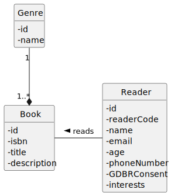

# US 13 - I want a list of book suggestions based on my interest list

## 1. Requirements Engineering

### 1.1. User Story Description

As Reader, I want a list of book suggestions based on my interest list

### 1.2. Customer Specifications and Clarifications

**From the specifications document:**

As Librarian, I want to know a user’s detail **given its reader number**

**From the client clarifications:**

> **Question:** Qual deveria ser o resultado da pesquisa de livros sugeridos, caso o leitor não tenha inserido uma lista de interesses?

> > **Answer:** Devem usar os top 5 genéros mais requisitados

> **Question:** De que forma devem ser sugeridos os livros relacionados com a lista de interesse?
                Devem ser apresentados os livros mais requisitados, escolhidos aleatoriamente ou por outro critério?
                Além disso, qual é o número máximo de livros que devem ser sugeridos por lista?

> > **Answer:**

> **Question:** De que forma devem ser sugeridos os livros relacionados com a lista de interesse?
Devem ser apresentados os livros mais requisitados, escolhidos aleatoriamente ou por outro critério?
Além disso, qual é o número máximo de livros que devem ser sugeridos por lista?

> > **Answer:** pode ser sugestão aleatória dentro dos livros dos interesses indicados pelo leitor 

### 1.3. Acceptance Criteria

- AC13-01: The user must be registered in the system to see it´s details.
- AC13-02: The ID must be existing

### 1.4. Found out Dependencies

* No dependencies were found.

### 1.5 Input and Output Data

**Input Data:**

- Typed Data:

  - Reader Number

**Output Data:**

  - (In)Success of the operation.
  - User´s details.

### 1.6. System Sequence Diagram (SSD)

### 1.7 Functionality

- n/a

### 1.8 Other Relevant Remarks

- n/a

## 2. OO Analysis

### 2.1. Relevant Domain Model Excerpt

### 2.2. Other Remarks

- n/a

## 3. Design - User Story Realization

### 3.1. Sequence Diagram (SD)

### 3.2. Class Diagram (CD)

## 4. Tests

- The Tests are in the folder tests.

## 5. Observations

- n/a
