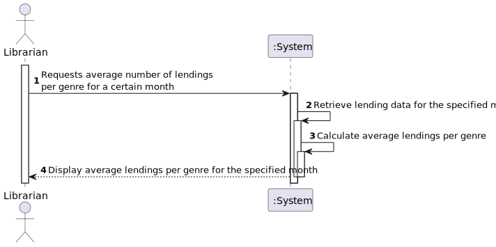
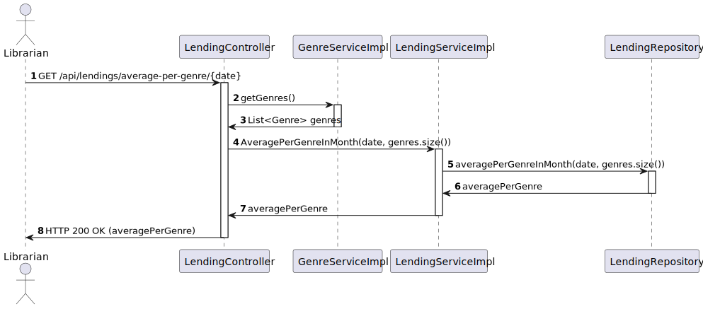
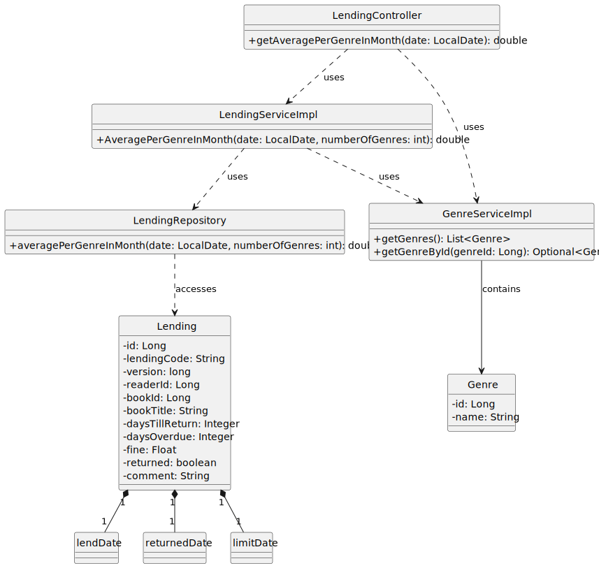

# US 14 - Know the average number of lending per genre of a certain month

## 1. Requirements Engineering

### 1.1. User Story Description

As Librarian I want to know the average number of lending per genre of a certain month

### 1.2. Customer Specifications and Clarifications

**From the specifications document:**

- n/a

**From the client clarifications:**

> **Question:** Para esta US, também são incluídos tanto empréstimos em aberto como devolvidos?

> > **Answer:** todos os emprestimos independente do seu estado

> **Question:** A média deve contemplar a parte decimal do valor? Se sim, com quantas casas decimais?

> > **Answer:** sim. 1 casa decimal

> **Question:** Mais uma questão sobre esta US: O que é que é realmente pretendido? A média diária de empréstimos por género num dado mês? Ou a média mensal de empréstimos por género num mês, ao longo de vários anos?

> > **Answer:** Boa tarde
Pretende-se saber para esse mês , em média, quantos livros de um dado género foram emprestados por dia

> **Question:** Pretende-se receber uma resposta com todos os gêneros e respetiva media de empréstimos num determinado mês, ou apenas a media de empréstimos num dado mês e gênero?

> > **Answer:** De todos os géneros

### 1.3. Acceptance Criteria

- AC14-01: n/a

### 1.4. Found out Dependencies

* n/a

### 1.5 Input and Output Data

**Input Data:**

- Typed Data:
  - Month
  - Year

**Output Data:**

- (In)Success of the operation.
- Average number of lending per genre of a certain month

### 1.6. System Sequence Diagram (SSD)

### 1.7 Functionality

- n/a

### 1.8 Other Relevant Remarks

- n/a

## 2. OO Analysis

### 2.1. Relevant Domain Model Excerpt

### 2.2. Other Remarks

- n/a

## 3. Design - User Story Realization

### 3.1. Sequence Diagram (SD)

### 3.2. Class Diagram (CD)

## 4. Tests

- The Tests are in the folder tests.

## 5. Observations

- n/a
