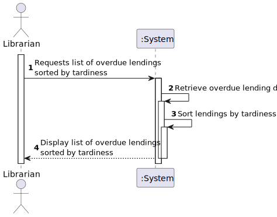
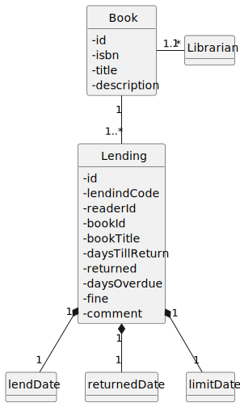
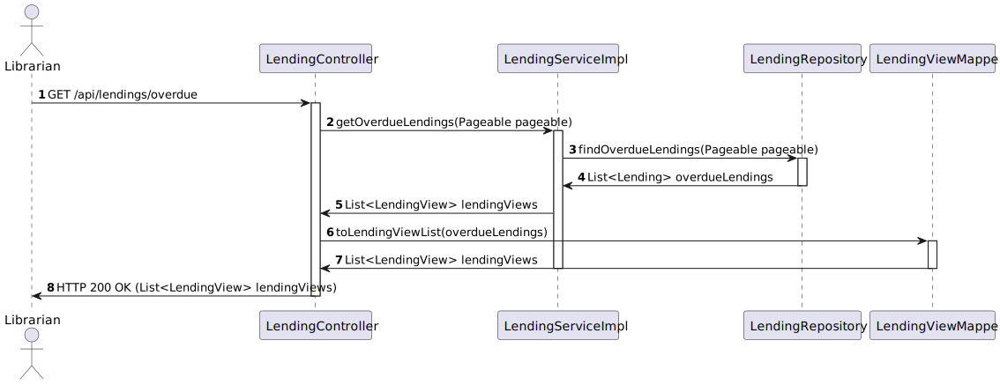
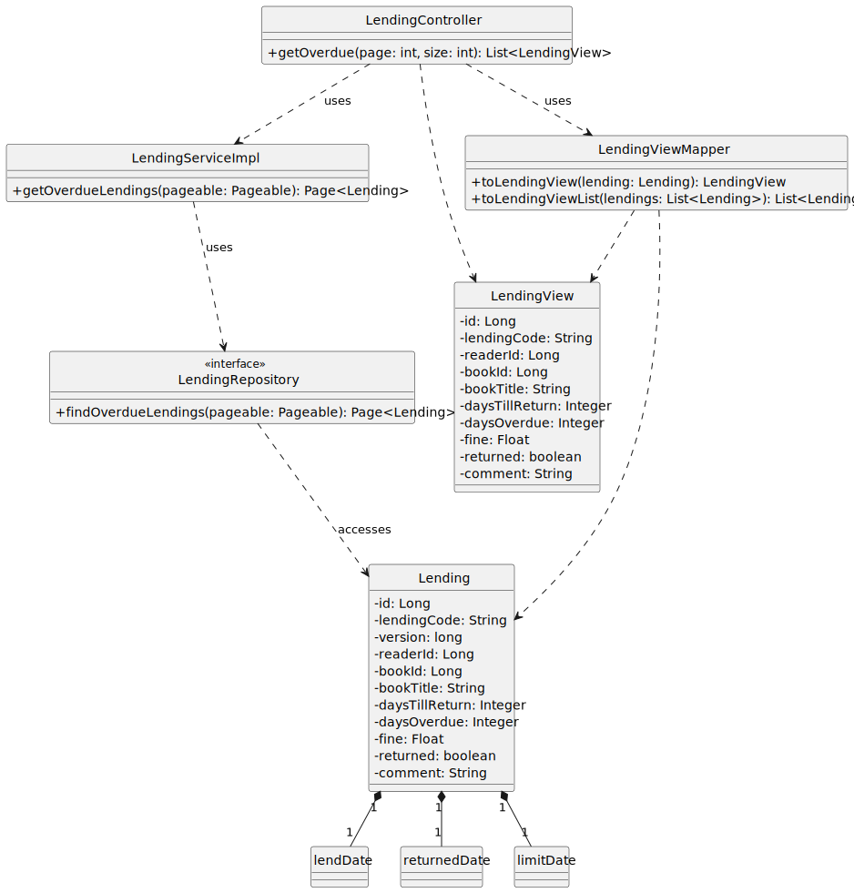

# US 23 - List overdue lending sorted by their tardiness

## 1. Requirements Engineering

### 1.1. User Story Description

As Librarian I want to list overdue lending sorted by their tardiness.

### 1.2. Customer Specifications and Clarifications 

**From the client clarifications:**

> **Question:** Bom dia,
A listagem de empréstimos em atraso diz respeito a livros que se encontram emprestados, livros que já foram devolvidos ou ambos?

> > **Answer:** bom dia,
livros emprestados e que ainda nao foram devolvidos

> **Question:** Não sei se é o local apropriado para a questão, mas qual é o número máximo de empréstimos que devem ser apresentados a cada consulta?

> > **Answer:** não há limite, mas devem suportar paginação no caso de operações com elevado número de resultados

### 1.3. Acceptance Criteria

- AC23-01:  
- AC23-02:

### 1.4. Found out Dependencies

- 

### 1.5 Input and Output Data

**Input Data:**

- Typed data:
    - 
    - 

- Selected data:
    - n/a

**Output Data:**

- (In)success of the operation
- 
- 

### 1.6. System Sequence Diagram (SSD)

### 1.7 Functionality

- n/a

### 1.8 Other Relevant Remarks

- n/a

## 2. OO Analysis

### 2.1. Relevant Domain Model Excerpt 

### 2.2. Other Relevant Remarks

- n/a

## 3. Design

### 3.1. Sequence Diagram (SD)

### 3.2. Class Diagram (CD)

Class diagram as resulting from the above sequence diagram and rationale:

## 4. Tests

- The Tests are in the folder tests.

## 5. Observations

- n/a
