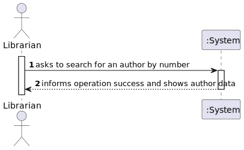
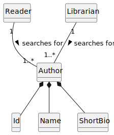
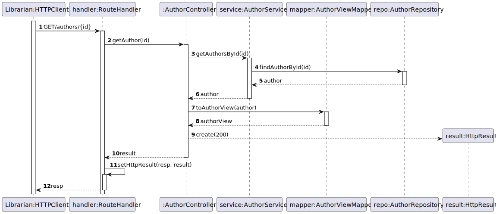
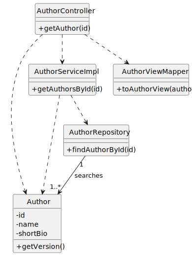

# US 05 - Search Author by Number

## 1. Requirements Engineering

### 1.1. User Story Description

As Librarian or Reader I want to know an author’s detail given its author number.

### 1.2. Customer Specifications and Clarifications

**From the specifications document:**

> Show the author details by its author number.

**From the client clarifications:**

> **Question:**
> Quais são os critério de aceitação (acceptance criteria) da us05? \
> **Answer:**
> Se o utilizador introduzir um número de autor existente devem 
> ser mostrados todos os dados do autor.
> Se o utilizador introduzir um número de autor inexistente deve 
> ser indicado erro.

### 1.3. Acceptance Criteria

- AC03-01: If the user inserts an existent author number it should show the information about the author.
- AC03-02: If the user inserts a nonexistent author number it should show and error message. 

### 1.4. Found out Dependencies

* No dependencies were found.

### 1.5 Input and Output Data

**Input Data:**

- Typed Data:

    - Author number.

**Output Data:**

- Success of the operation.
- Author Data.

### 1.6. System Sequence Diagram (SSD)

### 1.7 Functionality

n/a

### 1.8 Other Relevant Remarks

n/a

## 2. OO Analysis

### 2.1. Relevant Domain Model Excerpt

### 2.2. Other Remarks

- n/a

## 3. Design - User Story Realization

### 3.1. Sequence Diagram (SD)

### 3.2. Class Diagram (CD)

## 4. Tests

- The Tests are in the folder tests.

## 5. Observations

n/a