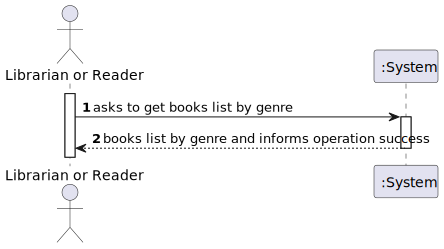
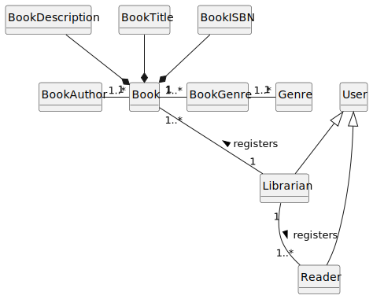
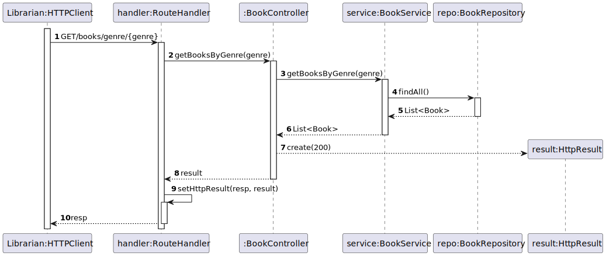
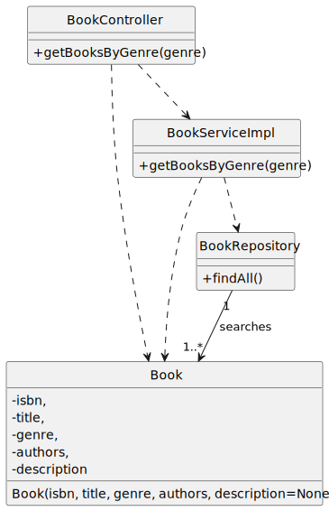

# US 10 - Get books by genre

## 1. Requirements Engineering

### 1.1. User Story Description

As Librarian or Reader I want to search books by genre

### 1.2. Customer Specifications and Clarifications 

**From the client clarifications:**

> **Question:** Boa tarde, quais são os critérios de aceitação das us09(As Librarian or Reader I want to know the details of a book given its ISBN) e us10(. As Librarian or Reader I want to search books by genre)?

> > **Answer:** devem ser mostrados todos os livros do género indicado. a pesquisa deve ser não exata, exemplo, se pesquisar por "**fi**" devem ser devolvidos os livros do género "**fi**ccao" e do género "**fi**nancas"

### 1.3. Acceptance Criteria

- AC10-1: All books of the indicated genre must be shown. The search should be non-exact, 
for example, if searching for "fi," books of the genres "fiction" and "finance" should be returned.

### 1.4. Found out Dependencies

- No dependencies were found.

### 1.5 Input and Output Data

**Input Data:**

- Typed data:
    - genre

- Selected data:
    - n/a

**Output Data:**

- (In)success of the operation
- List of books based on the genre that has been given to the API

### 1.6. System Sequence Diagram (SSD)

### 1.7 Other Relevant Remarks

- n/a

### 1.8 Other Relevant Remarks

- n/a

## 2. OO Analysis

### 2.1. Relevant Domain Model Excerpt 

### 2.2. Other Remarks

- n/a

## 3. Design - User Story Realization

### 3.1. Sequence Diagram (SD)

### 3.2. Class Diagram (CD)

## 4. Tests

- The Tests are in the folder tests.

## 5. Observations

n/a
