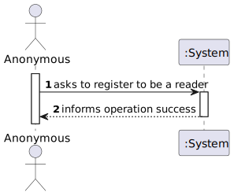
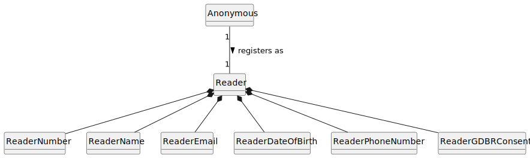
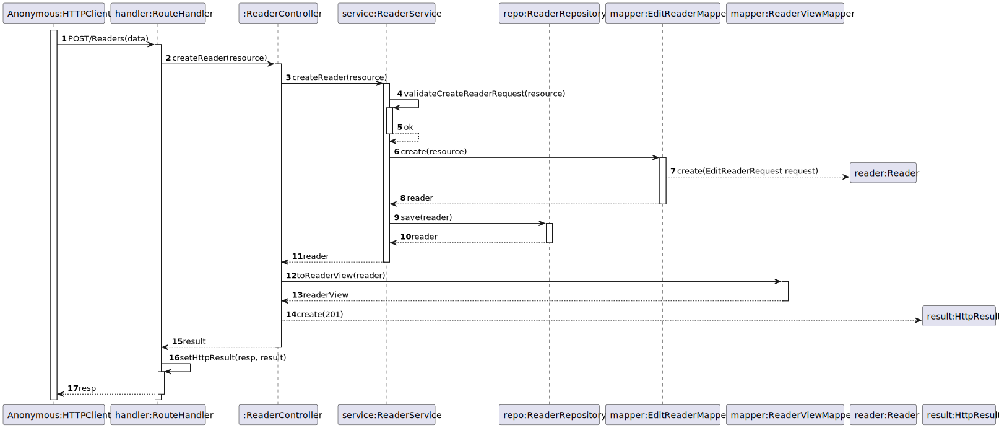
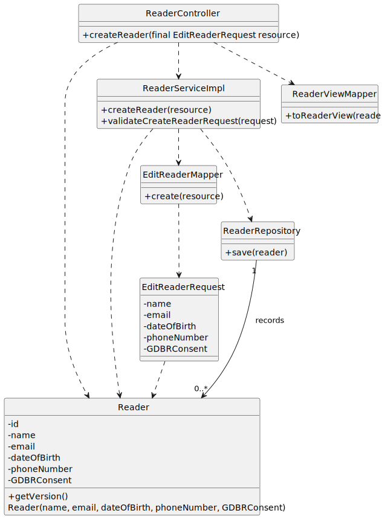

# US 11 - I want to register as a reader.

## 1. Requirements Engineering

### 1.1. User Story Description

As anonymous I want to register as a reader (name, email, date of birth, phone number, GDPR consent).

### 1.2. Customer Specifications and Clarifications

**From the specifications document:**

- A Reader Number is assigned to me by the library.

**From the client clarifications:**

> **Question:** É requisitado apenas o 1º e ultimo nome? 3, 4, 5 nomes?

> > **Answer:** não necessitamos distinguir quantos nomes a pessoa tem

> **Question:** São permitidos títulos? (Sr., Dr., …)

> > **Answer:** nao há necessidade de capturar esta informação

> **Question:** Apenas devem ser permitidas letras?

> >**Answer:** qualquer caracter alfanumérico

> **Question:** Deve ser apenas permitido o alfabeto latino? Devem ser permitido outros alfabetos (cirilico, grego, ...) ou sistemas de escrita (árabe, hebraico, ...)?

> > **Answer:** basta considerar o alfabeto Latino

> **Question:** Pode ser deixado vazio?

> > **Answer:** não

> **Question:** Pode ter apenas espaços?

> > **Answer:** não

> **Question:** Existem algumas palavras proibidas?

> > **Answer:** sim. deve existir no sistema uma configuração de "palavras proibidas" que não são aceites no nome do Leitor

> **Question:** Um utilizador pode ter vários emails?

> > **Answer:** não

> **Question:** Um mesmo email pode pertencer a vários utilizadores?

> > **Answer:** não

> **Question:** É necessário validar se o email realmente existe?

> > **Answer:** não basta que esteja no formato correto 

> **Question:** Permite todos os dominios de email? Ou apenas um grupo (gmail.com, hotmail.com, isep.ipp.pt)? Se sim, quais?

> > **Answer:** qualquer dominio 

> **Question:** Existe uma idade mínima? (ex. nascido em 2024)

> > **Answer:** Leitor deve ter pelo menos 12 anos

> **Question:** Existe uma idade máxima? (Ex. nascido em 1812)

> > **Answer:** não

> **Question:** A idade influencia algo? (Acesso a certas funcionalidades/livros, Recomendação de livros)

> > **Answer:** de momento esse controlo é feito fisicamente pelo bibliotecário e fora do sistema

> **Question:** Um utilizador pode ter vários números de telefone?

> > **Answer:** não 

> **Question:** Um mesmo número de telefone pode ser usado em vários leitores?

> > **Answer:** sim

> **Question:** O número de telefone deve ser português ou admite outros países?

> > **Answer:** basta considerar numeros portugueses de momento

> **Question:** O número de telefone deve ser móvel ou pode ser fixo?

> > **Answer:** ambos 

> **Question:** Um simples sim/não é suficiente ou deve ter algum tipo de assinatura digital?

> > **Answer:** simples "sim/não"

> **Question:** Que efeitos existem ao recusar? É permitido ao utilizador criar conta como leitor? Perde algumas funcionalidades?

> > **Answer:** o utilizador tem que aceitar a politica de privacidade de dados. se recusar não se poderá registar no sistema

> **Question:** Posso recusar apenas parcialmente?

> > **Answer:** é possivel recusar o consentimento de partilha de informação com terceiros, bem como o consentimento para efeitos de marketing

> **Question:** Deve ter um tamanho pré-definido (Ex. todos os nºs devem ter 8 caracteres)

> > **Answer:** não 

> **Question:** Segue alguma regra (ex. certos números para certas bibliotecas/idades/…) ou é apenas auto-incremental?

> > **Answer:** é composto pelo ano de registo e um número sequencial, ex., 2023/1, 2024/19876

### 1.3. Acceptance Criteria

- AC11-01: The name, email, date of birth, phone number, GDPR consent must be provided to register as a reader.
- AC11-02: If any input is in the wrong format or an obligatory data is missing, there must be an error warning.
- AC11-03: GDBR Consent  must be true.

### 1.4. Found out Dependencies

* No dependencies were found.

### 1.5 Input and Output Data

**Input Data:**

- Typed Data:

  - Name
  - E-mail
  - Date Of Birth 
  - Phone Number
  - GDPR consent 

**Output Data:**

- (In)Success of the operation.

### 1.6. System Sequence Diagram (SSD)

### 1.7 Functionality

- n/a

### 1.8 Other Relevant Remarks

- n/a

## 2. OO Analysis

### 2.1. Relevant Domain Model Excerpt

### 2.2. Other Remarks

- n/a

## 3. Design - User Story Realization

### 3.1. Sequence Diagram (SD)

### 3.2. Class Diagram (CD)

## 4. Tests

- The Tests are in the folder tests.

## 5. Observations

- n/a
