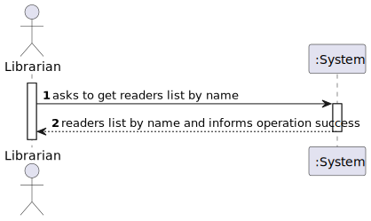
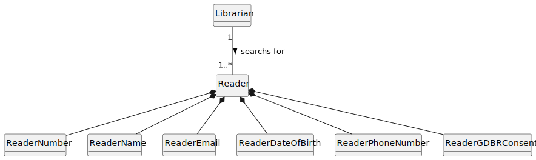
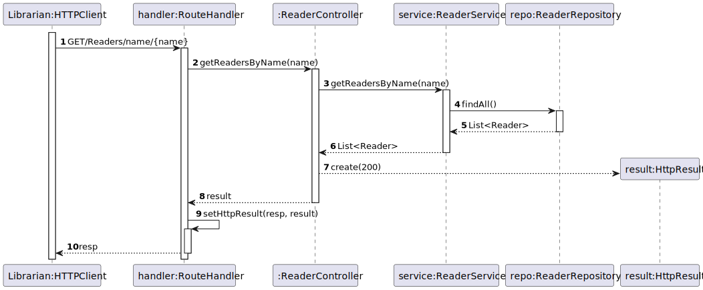
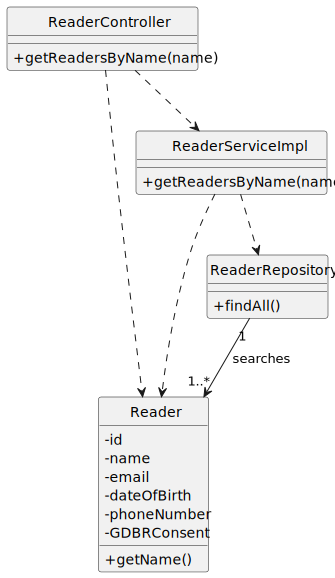

# US 14 - I want to search Readers.

## 1. Requirements Engineering

### 1.1. User Story Description

As Librarian, I want to search Readers **by name.**

### 1.2. Customer Specifications and Clarifications

**From the specifications document:**

The readers will be searched by name.

**From the client clarifications:**

> **Question:** Existem algumas palavras proibidas?

> > **Answer:** sim. deve existir no sistema uma configuração de "palavras proibidas" que não são aceites no nome do Leitor

### 1.3. Acceptance Criteria

- AC14-01: The user must be registered in the system to be possible to seach by name.
- AC14-02: The username must be valid.

### 1.4. Found out Dependencies

* The readers must be in the system.

### 1.5 Input and Output Data

**Input Data:**

- Typed Data:

  - The name of the Reader

**Output Data:**

- (In)Success of the operation.
- Readers list by name.

### 1.6. System Sequence Diagram (SSD)

### 1.7 Functionality

- n/a

### 1.8 Other Relevant Remarks

- n/a

## 2. OO Analysis

### 2.1. Relevant Domain Model Excerpt

### 2.2. Other Remarks

- n/a

## 3. Design - User Story Realization

### 3.1. Sequence Diagram (SD)

### 3.2. Class Diagram (CD)

## 4. Tests

- The Tests are in the folder tests.

## 5. Observations

- n/a
