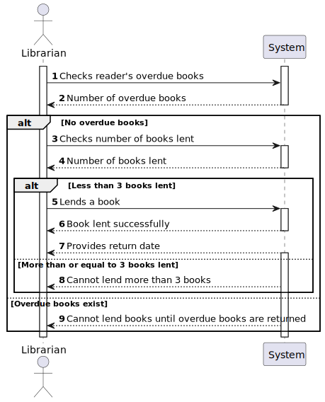
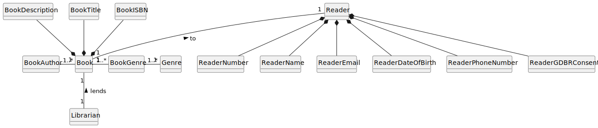
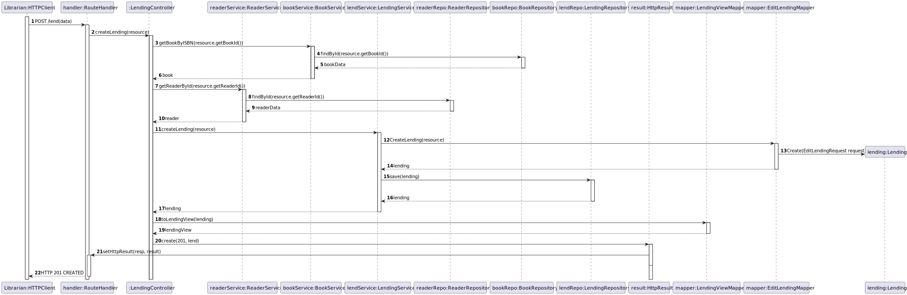
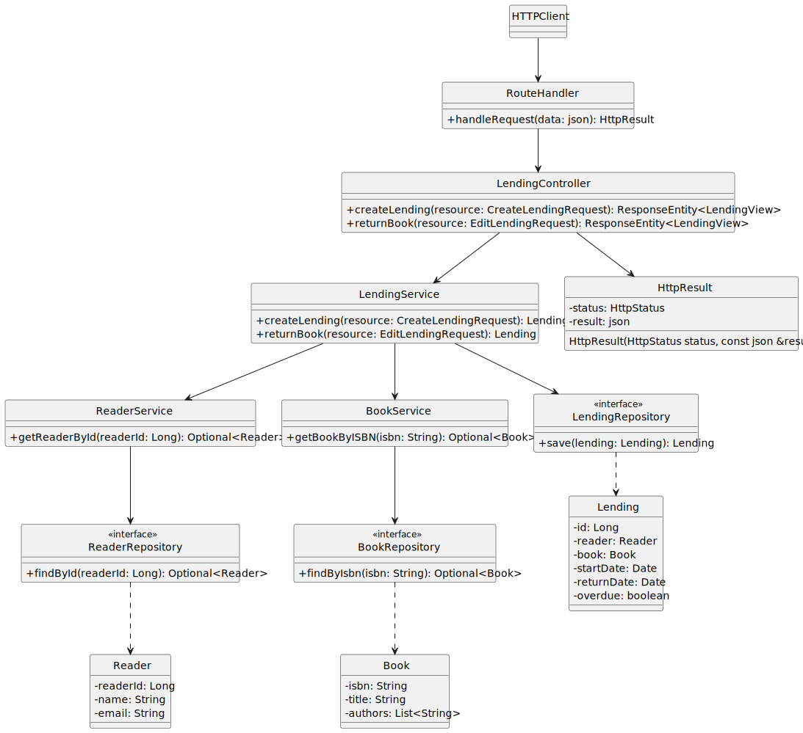

# US 15 - As Librarian I want to lend a book to a reader.

## 1. Requirements Engineering

### 1.1. User Story Description

As Librarian I want to lend a book to a reader.

### 1.2. Customer Specifications and Clarifications 

**From the client clarifications:**

> **Question:** a associação do emprestimo ao livro pode ser feito atraves do isbn? (usar o isbn como id do livro)

> > **Answer:** O isbn é identificador do livro.

> **Question:** Boa tarde quando o librarian for associar um livro a um leitor, o reader e book são selecionados de uma lista do sistema?

> > **Answer:** o empréstimo será de um dos livroo da biblioteca e a um dos leitores da biblioteca. ambos previamente registados no sistema.

> **Question:** A data de returno é escrita pelo librarian, como imput data?

> > **Answer:** a data de retorno deve ser calculada pelo sistema

> **Question:** Bom dia. Será possível fazer um empréstimo de vários livros a um leitor? Ou cada livro emprestado, corresponde a um só empréstimo?

> > **Answer:** um empréstimo é apenas de um único livro

> **Question:** Boa tarde quando o librarian for associar um livro a um leitor, o reader e book são selecionados de uma lista do sistema?
A data de returno é escrita pelo librarian, como imput data?

> > **Answer:** o empréstimo será de um dos livroo da biblioteca e a um dos leitores da biblioteca. ambos previamente registados no sistema.
a data de retorno deve ser calculada pelo sistema

### 1.3. Acceptance Criteria

- AC15-01:  The lending can only be done if the reader has no
  overdue books.

- AC15-02: The reader can have at most 3 books lent.

- AC15-03: The return date must be presented
  to the Librarian.

- AC15-04: A lending corresponds to only one book.

- AC15-05: An anonymous cannot request a book.

### 1.4. Found out Dependencies

- Only readers (registered user) can request a book.

### 1.5 Input and Output Data

**Input Data:**

- Typed data:
    - Reader ID 
    - ISBN 

- Selected data:
    - n/a

**Output Data:**

- (In)success of the operation
- Lending Code 
- Return Date

### 1.6. System Sequence Diagram (SSD)

### 1.7 Functionality

- n/a

### 1.8 Other Relevant Remarks

- n/a

## 2. OO Analysis

### 2.1. Relevant Domain Model Excerpt 

### 2.2. Other Relevant Remarks

- n/a

## 3. Design

### 3.1. Sequence Diagram (SD)

### 3.2. Class Diagram (CD)

Class diagram as resulting from the above sequence diagram and rationale:

## 4. Tests

- The Tests are in the folder tests.

## 5. Observations

- n/a
