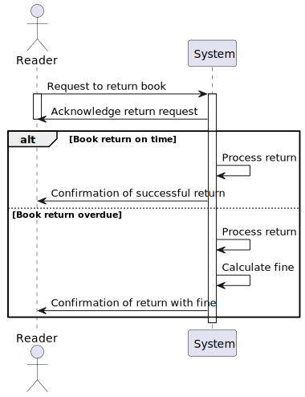
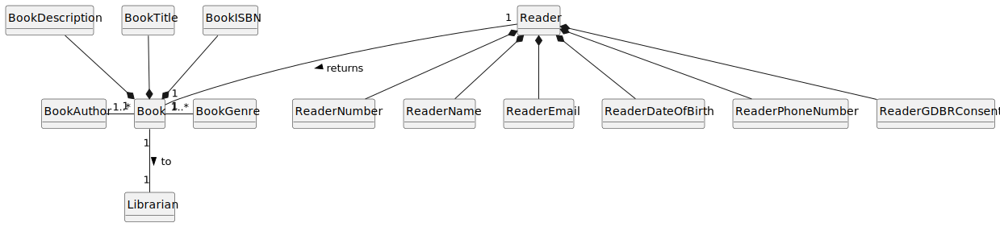
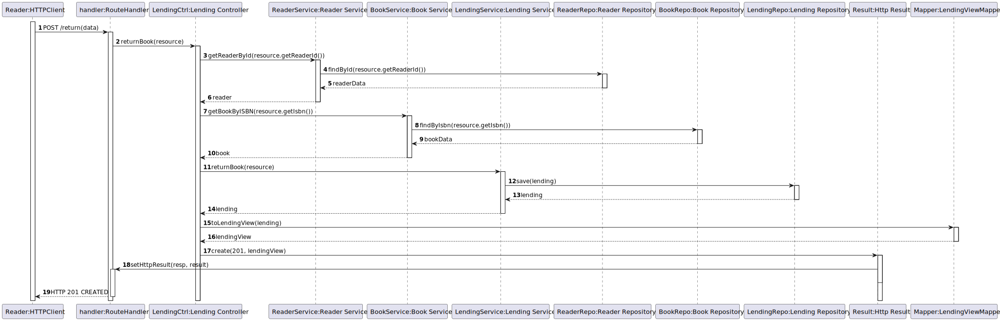
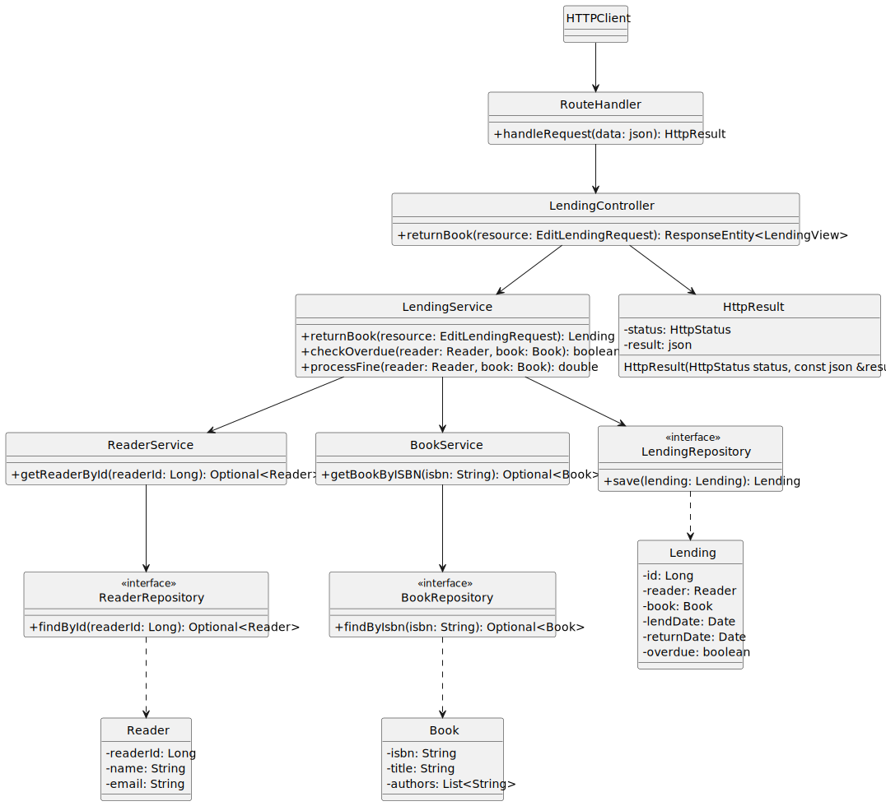

# US 16 - As Reader I want to return a book.

## 1. Requirements Engineering

### 1.1. User Story Description

As Reader I want to return a book. If the return is overdue I’m fined by the library.

### 1.2. Customer Specifications and Clarifications 

**From the client clarifications:**

> **Question:** Quando um utilizador pretende devolver um livro, que informação é que o sistema lhe deve pedir?

> > **Answer:** deve ser dada a possibilidade de colocar um comentário/observações (opcional)

> **Question:** O valor da multa - e se passou o prazo de devolução - é calculado aquando da consulta do empréstimo / momento de devolução, ou é algo a ser calculado periodicamente?

> > **Answer:** esta é uma decisão de implementação. de um ponto de vista funcional o importante é que quando se tenta devolver o livro o valor da multa seja o correto

> **Question:** O valor da multa é algo a ser persistido na base de dados? Dos empréstimos cujos livros foram devolvidos; ou de todos, incluindo os em aberto?

> > **Answer:** sim. será posteriormente tratado por outra parte do sistema efetuar a cobrança (fora de âmbito)

> **Question:** A multa tem um valor máximo?

> > **Answer:** não

> **Question:** A questão era no sentido de saber se o sistema pede ao reader o lending number ou o isbn para identificar o livro a devolver.

> > **Answer:** Deve existir as duas possibilidades

> **Question:** O comentário fica afeto ao livro, ou ao empréstimo?

> > **Answer:** o comentário é sobre o empréstimo.

> **Question:** Qual é o comprimento máximo do comentário?

> > **Answer:** 1024 caracteres.

> **Question:** A US diz: As Reader I want to return a book. If the return is overdue I’m fined by the library.

> > **Answer:** 

> **Question:** No caso de haver 'fine' a aplicar, o sistema deve marcar o livro como devolvido na mesma?

> > **Answer:** sim

> **Question:** O que deve ficar registado na base de dados neste caso?

> > **Answer:** ignorando o facto do cliente nao saber responder a esta pergunta quando formulado desta forma, o que se pretende com este caso de uso é registar que o livro foi devolvido, por quem, quando, em que condições e se foi ou não aplicada uma multa e de que valor

> **Question:** O que deve ser mostrado ao utilizador no caso de atraso na devolução?

> > **Answer:** o valor da multa 

### 1.3. Acceptance Criteria

- AC16-01: The reader must pay the fine before being able to borrow another book or use other library services.

### 1.4. Found out Dependencies

- No dependencies were found.
  
### 1.5 Input and Output Data

**Input Data:**

- Typed data:
    - ISBN
    - Reader ID
    - Lending Code
    - Comment(optional)
  
- Selected data:
    - n/a

**Output Data:**

- (In)success of the operation.
- A fine if the book is overdue.

### 1.6. System Sequence Diagram (SSD)

### 1.7 Functionality

- n/a

### 1.8 Other Relevant Remarks

- n/a

## 2. OO Analysis

### 2.1. Relevant Domain Model Excerpt 

### 2.2. Other Relevant Remarks

- n/a

## 3. Design

### 3.1. Sequence Diagram (SD)

### 3.2. Class Diagram (CD)

Class diagram as resulting from the above sequence diagram and rationale:

## 4. Tests

- The Tests are in the folder tests.

## 5. Observations

n/a
