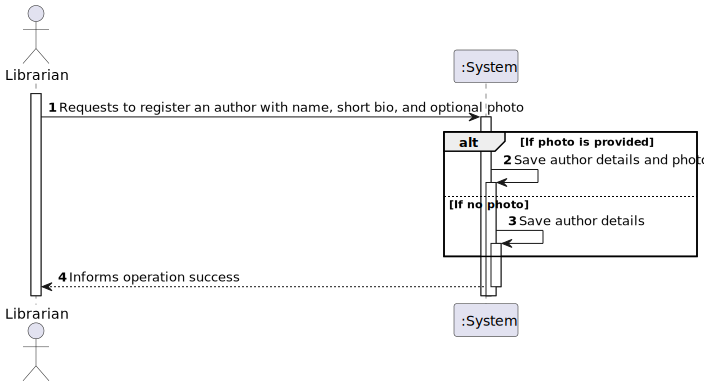
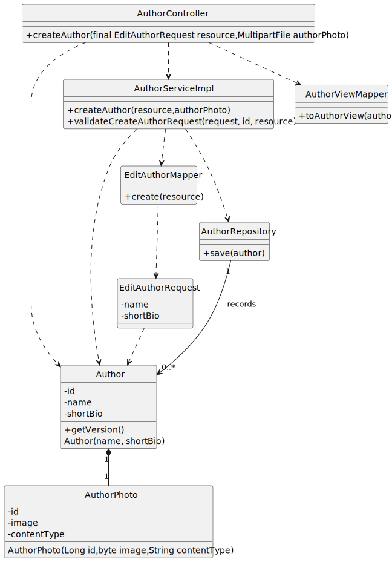

# US 03 - As Librarian I want to register an author with a photo

## 1. Requirements Engineering

### 1.1. User Story Description

As Librarian I want to register an author with an **optional** photo

### 1.2. Customer Specifications and Clarifications

**From the specifications document:**

> The author as a name, short bio and an author number.

**From the client clarifications:**

> **Question:**
> Gostava de saber se quando o bibliotecário cria a bio do autor, 
> apenas é constituído por texto ou tem outro campo?
> Aproveito e pergunto sobre o número do autor, se este é 
> apenas um numero e como este é formado? \
> **Answer:**
> A breve biografia do autor deve permitir conteudo HTML. O 
> numero do autor é um número sequencial gerado pelo sistema.

> **Question:**
> Quão breve deverá ser a biografia? Existe um limite de caracteres? \
> **Answer:**
> No máximo 4096 carcateres.

> **Question:**
> Pode haver nomes repetidos entre autores? \
> **Answer:**
> Sim.

> **Question:**
> É obrigatório preencher as caracteristicas do autor (name, short_bio) ? Ou apenas uma delas? 
> Qual o minimo e o maximo de caracteres para um nome de um autor? \
> **Answer:**
> São ambas obrigatórias. Um nome de author tem um máximo de 150 caracteres.

> **Question:**
> Quais são os critério de aceitação (acceptance criteria) da us03? \
> **Answer:** 
> Ao introduzir todos os dados obrigatórios no formato correto, o autor deve 
> ficar registado no sistema. Ao introduzir algum dado no formato incorreto ou 
> não introduzir um dado obrigatório deve ser dada indicação de erro. Apenas 
> os utilizadores com permissões de librarian podem executar esta opção.

> **Question:**

> > **Answer:**

### 1.3. Acceptance Criteria

- AC03-01: After inserting all the required data in the correct format, the author most be registered in the system.
- AC03-02: If any input is in the wrong format or an obligatory data is missing, there must be an error warning.
- AC03-03: Only users with permissions of a librarian can execute this option.
- AC03-04: There is the possibility to add an image.

### 1.4. Found out Dependencies

* No dependencies were found.

### 1.5 Input and Output Data

**Input Data:**

- Typed Data:

    - Name;
    - Short bio.

**Output Data:**

- (In)Success of the operation.

### 1.6. System Sequence Diagram (SSD)

### 1.7 Functionality

- n/a

### 1.8 Other Relevant Remarks

- n/a

## 2. OO Analysis

### 2.1. Relevant Domain Model Excerpt

### 2.2. Other Remarks

- n/a

## 3. Design - User Story Realization

### 3.1. Sequence Diagram (SD)

### 3.2. Class Diagram (CD)

## 4. Tests

- The Tests are in the folder tests.

## 5. Observations

- n/a
