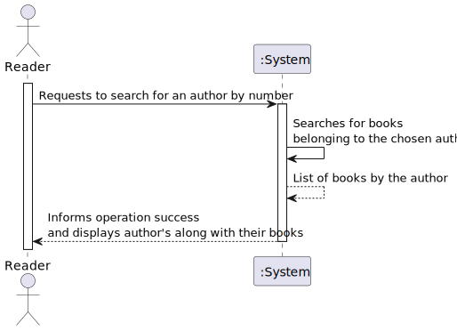
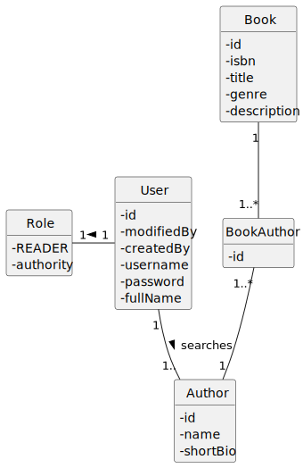
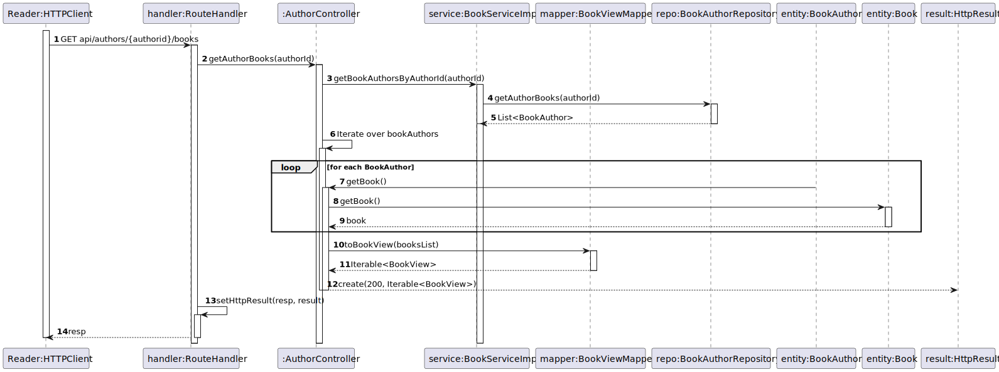
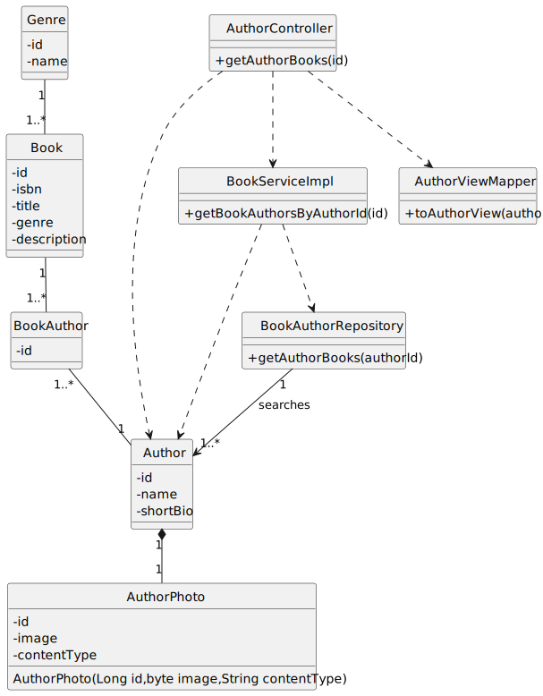

# US 04 - Know the books of an Author

## 1. Requirements Engineering

### 1.1. User Story Description

As Reader I want to know the books of an Author.

### 1.2. Customer Specifications and Clarifications

**From the specifications document:**

> 

**From the client clarifications:**

> **Question:**

> **Answer:**

### 1.3. Acceptance Criteria

- AC04-01: Should return the list of books from that author.
- AC04-02: Should return an empty list of books from that author in case the author doesn´t have any books.
- AC04-03: Pagination should be used if the list is to long.

### 1.4. Found out Dependencies

* The author must be registered.

### 1.5 Input and Output Data

**Input Data:**

- Typed Data:

    - 
    - 

**Output Data:**

- (In)Success of the operation.

### 1.6. System Sequence Diagram (SSD)

### 1.7 Functionality

n/a

### 1.8 Other Relevant Remarks

n/a

## 2. OO Analysis

### 2.1. Relevant Domain Model Excerpt

### 2.2. Other Remarks

- n/a

## 3. Design - User Story Realization

### 3.1. Sequence Diagram (SD)

### 3.2. Class Diagram (CD)

## 4. Tests

- The Tests are in the folder tests.

## 5. Observations

- 
