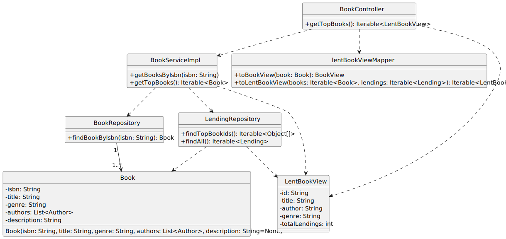

# US 09 - Know the top 5 books lent

## 1. Requirements Engineering

### 1.1. User Story Description

As Librarian I want to know the Top 5 books lent

### 1.2. Customer Specifications and Clarifications 

**From the client clarifications:**

> **Question:** 

> > **Answer:** 

### 1.3. Acceptance Criteria

- AC09-1: Returns the list of the 5 books that have been lent the most in the last year. It must return for each book, the number of times the book has been lent. the result must be sorted descending order.

### 1.4. Found out Dependencies

- No dependencies were found.

### 1.5 Input and Output Data

**Input Data:**

- Typed data:
    - 
    - 
    - 
    - 

- Selected data:
    - n/a

**Output Data:**

- (In)success of the operation
- 

### 1.6. System Sequence Diagram (SSD)

### 1.7 Functionality

- n/a

### 1.8 Other Relevant Remarks

- 

## 2. OO Analysis

### 2.1. Relevant Domain Model Excerpt 

### 2.2. Other Relevant Remarks

- n/a

## 3. Design

### 3.1. Sequence Diagram (SD)

### 3.2. Class Diagram (CD)

Class diagram as resulting from the above sequence diagram and rationale:

## 4. Tests

- The Tests are in the folder tests. 

## 5. Observations

n/a
