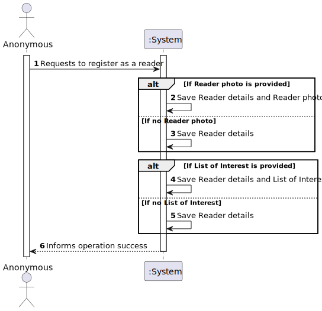
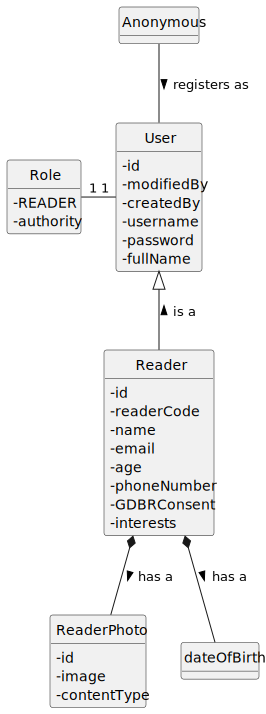
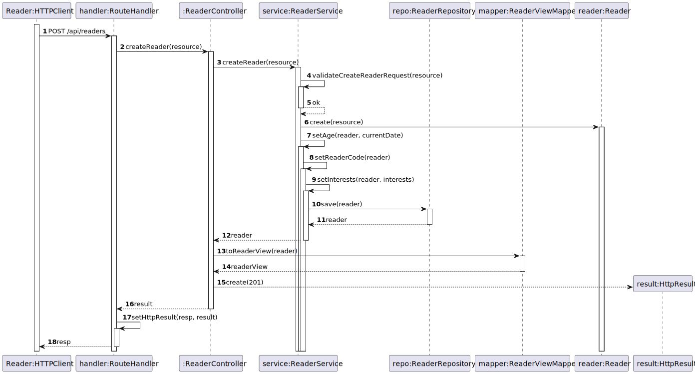
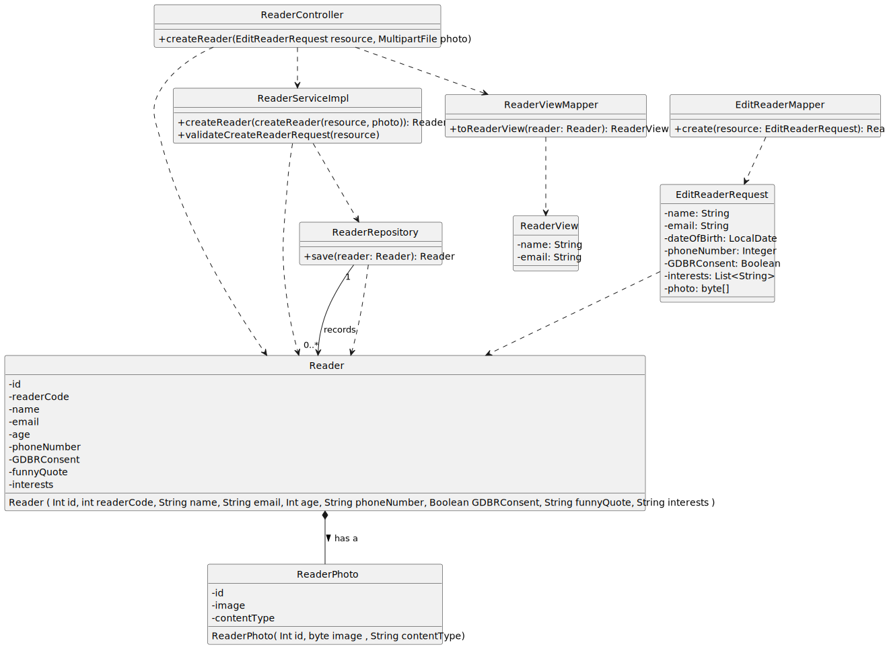

# US 12 - Register as a reader with an optional photo, and optional list of interest

## 1. Requirements Engineering

### 1.1. User Story Description

As anonymous, I want to register as a reader with an optional photo, and optional list of interest
(i.e., the genre I’m interested in)

### 1.2. Customer Specifications and Clarifications

**From the specifications document:**

- n/a

**From the client clarifications:**

> **Question:** Quais são os géneros a ser considerados para a lista de interesses? Os géneros disponíveis para os books?

> > **Answer:** sim. apenas pode escolher géneros da lista definida no WP0A.2

> **Question:** Boa tarde.
Quando um utilizador adiciona interesses à sua lista, deverá ser permitido inserir apenas géneros já existentes no sistema, ou o utilizador pode inserir livremente palavras-chave?
Se for permitida a inserção livre, existe uma lista de palavras ou interesses proibidos?

> > **Answer:** apenas generos existentes

### 1.3. Acceptance Criteria

- AC12-01: The reader´s number cannot be changed by the reader.
- AC12-01: The available genres of the books must be the ones from the Library.

### 1.4. Found out Dependencies

* No dependencies were found.

### 1.5 Input and Output Data

**Input Data:**

- Typed Data:

  - Name
  - E-mail
  - Date Of Birth
  - Phone Number
  - GDPR consent

**Output Data:**

  - (In)Success of the operation.

### 1.6. System Sequence Diagram (SSD)

### 1.7 Functionality

- n/a

### 1.8 Other Relevant Remarks

- n/a

## 2. OO Analysis

### 2.1. Relevant Domain Model Excerpt

### 2.2. Other Remarks

- n/a

## 3. Design - User Story Realization

### 3.1. Sequence Diagram (SD)

### 3.2. Class Diagram (CD)

## 4. Tests

- The Tests are in the folder tests.

## 5. Observations

- There is two different implementations for this US that have been coded,
  one using the PATCH request and another using the PUT. The first one lets the
  user edit just one or more attributes of the reader. Meanwhile, the other
  requires that all the attributes of the reader are changed. This documentation
  covers the PUT request.
