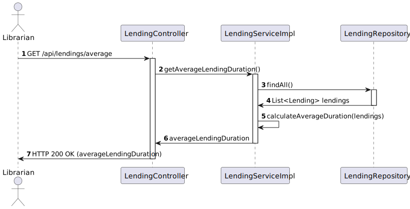

# US 15 - Know the Average lending duration.

## 1. Requirements Engineering

### 1.1. User Story Description

As Librarian I want to know the Average lending duration.

### 1.2. Customer Specifications and Clarifications 

**From the client clarifications:**

> **Question:** O resultado deve ser apresentado em número de dias?

> > **Answer:** sim

> **Question:** Com parte decimal, como na questão 3?

> > **Answer:** sim. 1 casa decimal

### 1.3. Acceptance Criteria

- AC15-01: n/a

### 1.4. Found out Dependencies

- n/a

### 1.5 Input and Output Data

**Input Data:**

- Typed data:
    - n/a

- Selected data:
    - n/a

**Output Data:**

- (In)success of the operation
- Average Lending duration

### 1.6. System Sequence Diagram (SSD)

### 1.7 Functionality

- n/a

### 1.8 Other Relevant Remarks

- n/a

## 2. OO Analysis

### 2.1. Relevant Domain Model Excerpt 

### 2.2. Other Relevant Remarks

- n/a

## 3. Design

### 3.1. Sequence Diagram (SD)

### 3.2. Class Diagram (CD)

Class diagram as resulting from the above sequence diagram and rationale:

## 4. Tests

- The Tests are in the folder tests.

## 5. Observations

- n/a
