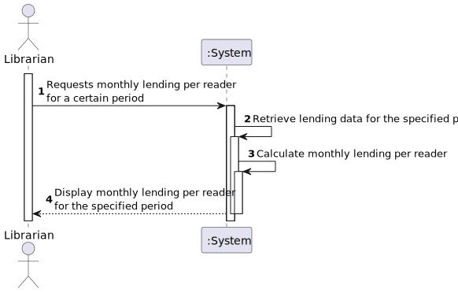
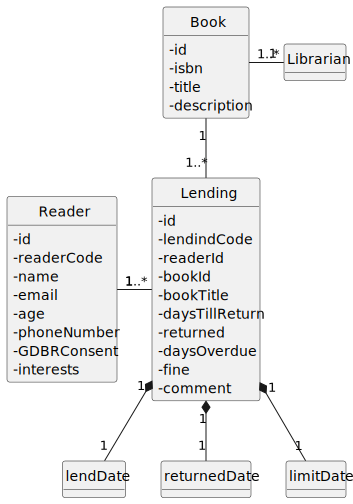
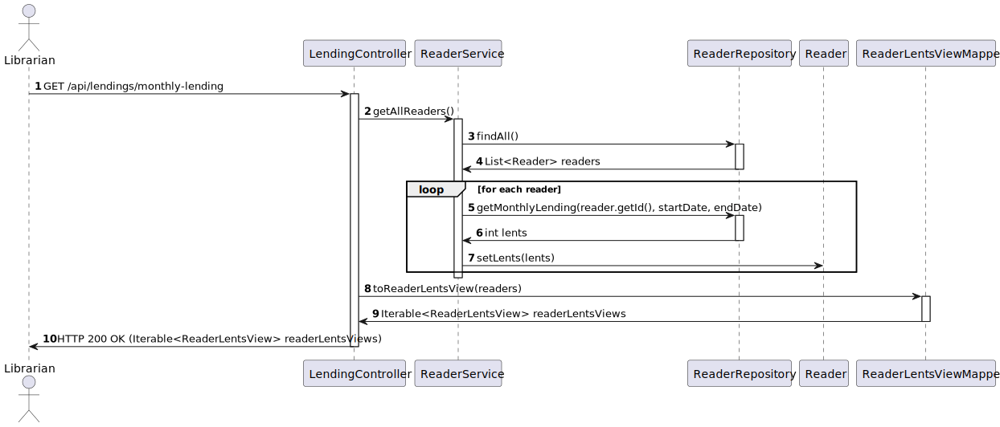
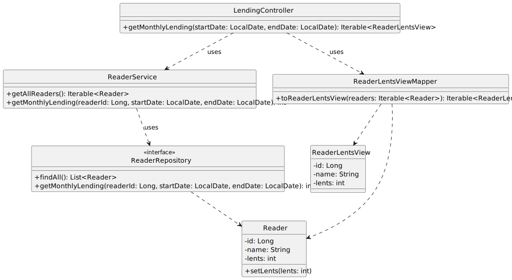

# US 18 - Know the Monthly lending per reader of a certain period

## 1. Requirements Engineering

### 1.1. User Story Description

As Librarian I want to know the Monthly lending per reader of a certain period.

### 1.2. Customer Specifications and Clarifications 

**From the client clarifications:**

> **Question:** Pretende-se uma lista de médias, ou a média de um utilizador em específico?

> > **Answer:** Boa tarde
Pretende-se a média de empréstimos. Ou seja, quantos livros foram emprestados num dado mês tendo em conta a totalidade de leitores registados na biblioteca

> **Question:** Não sei se percebi. A conta é média( total de empréstimos numa data / utilizadores registados a essa data), entre o início e o fim de um mês?

> > **Answer:** sim

### 1.3. Acceptance Criteria

- AC18-01: Returns a list with the number of lendings from a certain reader for a certain period of time.

### 1.4. Found out Dependencies

- No dependencies were found.
  
### 1.5 Input and Output Data

**Input Data:**

- Typed data:
    - 
  
- Selected data:
    - n/a

**Output Data:**

- (In)success of the operation
- 

### 1.6. System Sequence Diagram (SSD)

### 1.7 Functionality

- n/a

### 1.8 Other Relevant Remarks

- n/a

## 2. OO Analysis

### 2.1. Relevant Domain Model Excerpt 

### 2.2. Other Relevant Remarks

- n/a

## 3. Design

### 3.1. Sequence Diagram (SD)

### 3.2. Class Diagram (CD)

Class diagram as resulting from the above sequence diagram and rationale:

## 4. Tests

- The Tests are in the folder tests.

## 5. Observations

n/a
